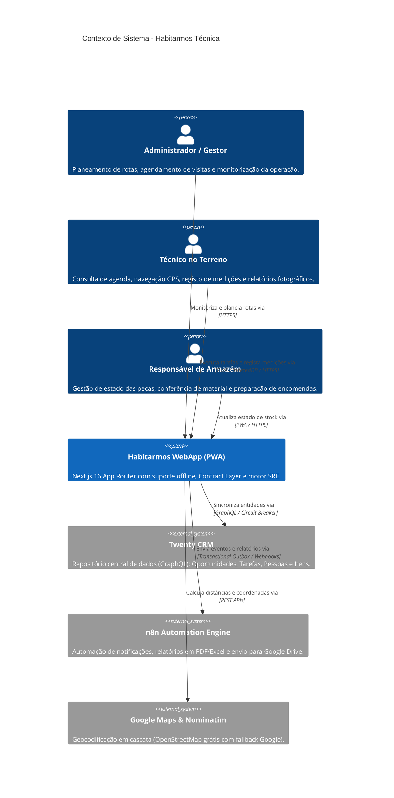
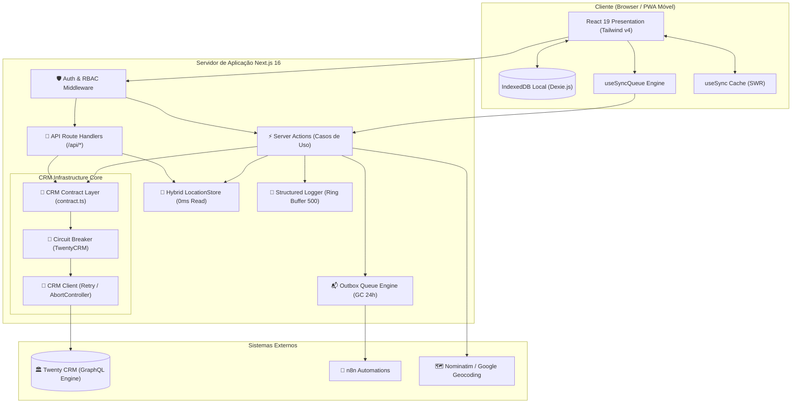
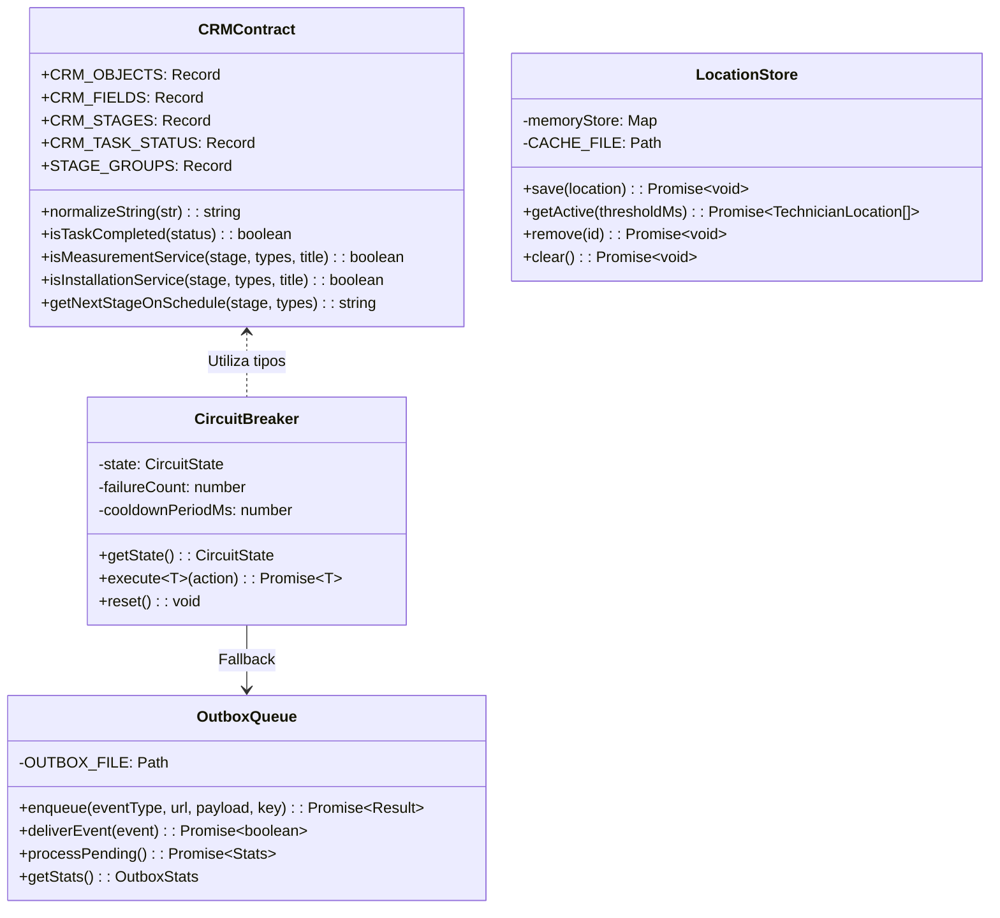
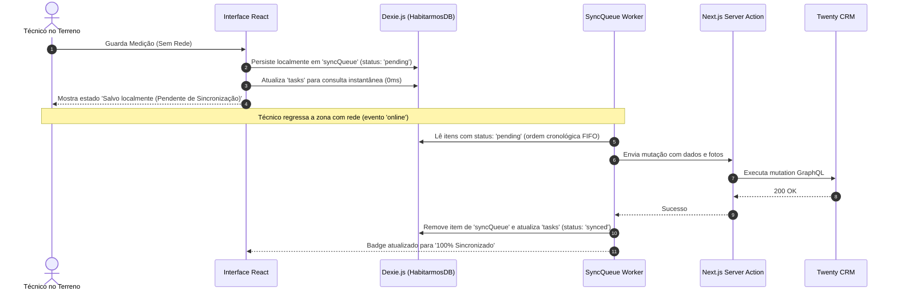
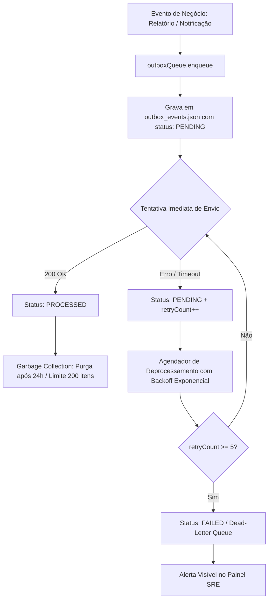
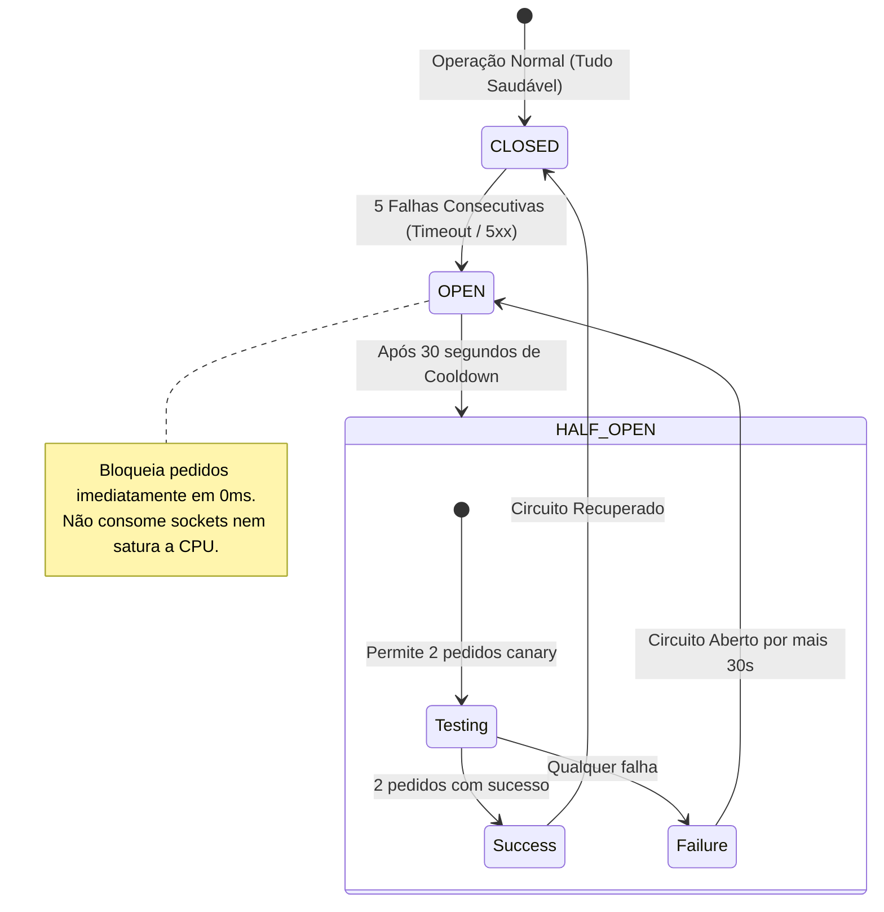
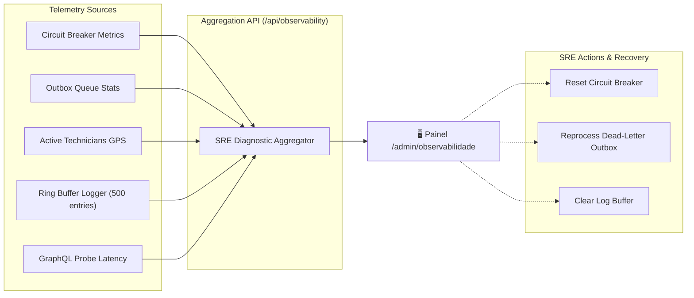
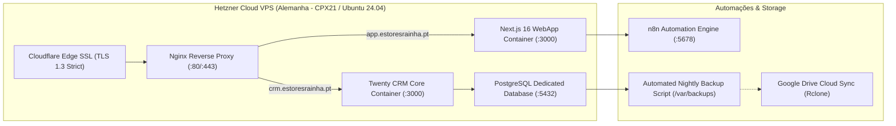

# 🏛️ Blueprint Mestre de Arquitetura & Engenharia de Sistemas
## Sistema Integrado de Gestão Técnica, Logística e IA Cognitiva — Habitarmos

---

## 📑 Índice Geral
1. [Visão Executiva & Princípios de Engenharia](#1-visão-executiva--princípios-de-engenharia)
2. [Arquitetura de Alto Nível (Modelo C4 com Diagramas)](#2-arquitetura-de-alto-nível-modelo-c4)
   - [2.1 C4 Nível 1: Contexto de Sistema](#21-c4-nível-1-diagrama-de-contexto-de-sistema)
   - [2.2 C4 Nível 2: Contentores de Aplicação](#22-c4-nível-2-diagrama-de-contentores-containers)
   - [2.3 C4 Nível 3: Camada de Infraestrutura e Resiliência](#23-c4-nível-3-diagrama-de-componentes-da-camada-de-infraestrutura)
3. [Camada de Contrato CRM & Desacoplamento (Contract Layer)](#3-camada-de-contrato-crm--desacoplamento-contract-layer)
4. [Máquina de Estados & Transições de Estágio do Funil](#4-máquina-de-estados--transições-de-estágio-do-funil)
5. [Motor Offline-First, IndexedDB & SyncQueue](#5-motor-offline-first-indexeddb--syncqueue)
6. [Padrão Transactional Outbox com Garbage Collection](#6-padrão-transactional-outbox-com-garbage-collection)
7. [Circuit Breaker, Timeouts & Tolerância a Falhas](#7-circuit-breaker-timeouts--tolerância-a-falhas)
8. [Rastreio GPS Híbrido & Proteção de Privacidade RGPD](#8-rastreio-gps-híbrido--proteção-de-privacidade-rgpd)
9. [Segurança em Profundidade & Matriz RBAC](#9-segurança-em-profundidade--matriz-rbac)
10. [Observabilidade SRE, Telemetria & QA 360](#10-observabilidade-sre-telemetria--qa-360)
11. [Topologia de Produção Hetzner & DevOps](#11-topologia-de-produção-hetzner--devops)

---

## 1. Visão Executiva & Princípios de Engenharia

O ecossistema **Habitarmos Técnica** é uma plataforma de missão crítica desenhada para operar **24 horas por dia, 7 dias por semana, com tolerância total a falhas**.
O sistema assegura a continuidade de negócio em operações de terreno, blindando a aplicação contra indisponibilidades de rede móvel, falhas de APIs externas ou alterações estruturais no Twenty CRM.

```
┌─────────────────────────────────────────────────────────────────────────────┐
│                          HABITARMOS CORE PLATFORM                           │
├──────────────────┬───────────────────────────┬──────────────────────────────┤
│ CRM CONTRACT BUS │     OFFLINE-FIRST SYNC    │     TRANSACTIONAL OUTBOX     │
│ Zero-Coupling    │   Dexie.js + Auto-Retry   │  At-Least-Once Delivery + GC │
├──────────────────┼───────────────────────────┼──────────────────────────────┤
│  CIRCUIT BREAKER │     HYBRID GPS ENGINE     │      SRE OBSERVABILITY       │
│  0ms Fail-Fast   │  Memory + RGPD Geofence   │  Live Telemetry + Diagnostics│
└──────────────────┴───────────────────────────┴──────────────────────────────┘
```

### Princípios Arquiteturais Inegociáveis:
1. **Spec-Driven Development (Zod como Single Source of Truth):** Todas as entidades de negócio possuem esquemas Zod estritos. Os tipos TypeScript são inferidos (`z.infer<typeof Schema>`).
2. **Clean Architecture com Failsafe Mutations:** Separação estrita entre Apresentação (`app/`), Casos de Uso (`actions/`) e Infraestrutura (`lib/crm/`). As mutações devolvem sempre `{ success: boolean, data?: any, error?: string }` sem lançar exceções não tratadas na UI.
3. **Desacoplamento do CRM via Contract Layer:** Nomes de tabelas, campos customizados e enums nunca aparecem hardcoded na UI ou em múltiplos repositórios. Estão concentrados exclusivamente em `contract.ts`.
4. **Resiliência Offline Nativa:** O trabalho do técnico (medições, folhas de obra e notas) é garantido no IndexedDB local antes de qualquer envio de rede, sincronizando automaticamente quando há conectividade.
5. **Garantia de Entrega sem Dual-Write:** Eventos para n8n, WhatsApp e Google Drive passam pela `OutboxQueue` persistida em disco, garantindo que falhas de rede nunca causam perda de notificações.

---

## 2. Arquitetura de Alto Nível (Modelo C4)

### 2.1 C4 Nível 1: Diagrama de Contexto de Sistema



---

### 2.2 C4 Nível 2: Diagrama de Contentores (Containers)



---

### 2.3 C4 Nível 3: Diagrama de Componentes da Camada de Infraestrutura



---

## 3. Camada de Contrato CRM & Desacoplamento (Contract Layer)

A **Camada de Contrato (`src/lib/crm/contract.ts`)** é a barreira arquitetural que isola a lógica da aplicação contra mutações no Twenty CRM:

```mermaid
graph TD
    subgraph "Twenty CRM GraphQL Schema"
        T1["Tabela: Opportunity"]
        T2["Tabela: Task"]
        T3["Tabela: Itemdeservico"]
        T4["Tabela: Appauth"]
        F1["Campos Custom: tipoDeServico, moradaDeServico, nsi"]
        F2["Campos Custom: technicianName, moradaDaReparacao"]
        F3["Campos Custom: largura, altura, preparado, estadoDoArmazem"]
    end

    subgraph "Contract Layer (contract.ts)"
        MAP_OBJ["CRM_OBJECTS"]
        MAP_FLD["CRM_FIELDS"]
        MAP_STG["CRM_STAGES"]
        MAP_TSK["CRM_TASK_STATUS"]
        MAP_WH["WAREHOUSE_STATUS"]
        MAP_GRP["STAGE_GROUPS"]
        HELPERS["Utility Functions (Pure Logic)"]
    end

    subgraph "Consumer Modules"
        M1["src/lib/crm/opportunities.ts"]
        M2["src/lib/crm/tasks.ts"]
        M3["src/lib/crm/measurements.ts"]
        M4["src/lib/crm/items.ts"]
        M5["src/lib/schemas/index.ts"]
        M6["src/app/admin/page.tsx"]
        M7["src/app/dashboard/page.tsx"]
    end

    T1 & T2 & T3 & T4 & F1 & F2 & F3 --> MAP_OBJ & MAP_FLD & MAP_STG & MAP_TSK & MAP_WH & MAP_GRP & HELPERS
    MAP_OBJ & MAP_FLD & MAP_STG & MAP_TSK & MAP_WH & MAP_GRP & HELPERS --> M1 & M2 & M3 & M4 & M5 & M6 & M7
```



### Mapeamentos Principais:
| Chave no Contrato | Nome Real no Twenty CRM | Descrição de Negócio |
|---|---|---|
| `CRM_OBJECTS.opportunity` | `opportunities` / `Opportunity` | Folha de Obra / Serviço Global |
| `CRM_OBJECTS.task` | `tasks` / `Task` | Visita Técnica Agendada |
| `CRM_OBJECTS.serviceItem` | `itemdeservicos` / `Itemdeservico` | Peça individual a fabricar/montar |
| `CRM_OBJECTS.auth` | `appauths` / `Appauth` | Credenciais de login bcrypt |
| `CRM_FIELDS.opportunity.serviceType` | `tipoDeServico` | Categoria (Estores, Portões, Caixilharia) |
| `CRM_FIELDS.serviceItem.prepared` | `preparado` | Booleano de controlo de armazém |
| `CRM_FIELDS.serviceItem.warehouseState`| `estadoDoArmazem` | Enum do estado no armazém |

---

## 4. Máquina de Estados & Transições de Estágio do Funil

O fluxo de estados garante a orquestração automática e coerente entre **Oportunidades** e **Tarefas**:

```mermaid
flowchart LR
    subgraph "1. Fase Comercial & Medição"
        E[ENTRADA] -->|Admin Agenda Visita| TM[TIRAR_MEDIDAS]
        TM -->|Técnico Submete Medição| ORC[ORCAMENTAR]
        ORC --> PROP[PROPOSTA]
        PROP --> P30[PAGAMENTO_30]
    end

    subgraph "2. Fase de Armazém & Preparação"
        P30 --> ENC[ENCOMENDA]
        ENC --> PREP[PREPARACAO]
        PREP -->|Todas as Peças Preparadas| MI[MARCAR_INSTALACAO]
    end

    subgraph "3. Fase de Montagem & Encerramento"
        MI -->|Admin Agenda Montagem| INST[INSTALACAO]
        INST -->|Técnico Conclui Folha de Obra| PT[PAGAMENTO_TOTAL]
        PT --> CONC[CONCLUIDO]
    end

    subgraph "Tratamento de Insucesso / Reagendamento"
        TM -.->|Incompleto / Ausente| E
        INST -.->|Falta de Material| MI
    end
```



### Regras de Transição Automática (`tasks.ts`):
1. **Conclusão de Medição:** Quando a tarefa de medição passa a `CONCLUIDO`, a Oportunidade avança automaticamente para `ORCAMENTAR`.
2. **Conclusão de Instalação:** Quando a tarefa de instalação passa a `CONCLUIDO`, a Oportunidade avança automaticamente para `PAGAMENTO_TOTAL`.
3. **Visita Incompleta / Falhada:** Se a visita for cancelada ou ficar incompleta, o estágio reverte com segurança para permitir novo agendamento no Admin.

---

## 5. Motor Offline-First, IndexedDB & SyncQueue



---

## 6. Padrão Transactional Outbox com Garbage Collection

Elimina a perda de dados entre mutações de base de dados e integrações externas (n8n, WhatsApp, Email, Google Drive):



---

## 7. Circuit Breaker, Timeouts & Tolerância a Falhas

O Circuit Breaker protege o servidor contra saturação de recursos quando o Twenty CRM sofre quebras:



---

## 8. Rastreio GPS Híbrido & Proteção de Privacidade RGPD

```mermaid
flowchart TD
    A[Técnico emite posição GPS] --> B{Consentimento Ativo no Browser?}
    B -- Não --> C[Descarta Telemetria]
    
    B -- Sim --> D{Horário de Trabalho? (07h00 - 22h00)}
    D -- Fora de Horas --> E[Descarta com status: paused]
    
    D -- Sim --> F{Pausa de Almoço? (13h00 - 14h00)}
    F -- Sim --> G[Proteção de Privacidade Ativa: status paused]
    
    F -- Não --> H{Intervalo < 2 segundos? (Rate Limit)}
    H -- Sim --> I[Debounce Suave: status rate_limited]
    
    H -- Não --> J[locationStore.save]
    J --> K[Memória RAM Map: 0ms Leitura Imediata]
    J --> L[Cache em Disco: locations_cache.json]
    K --> M[Disponível no Mapa Admin via GET /api/location]
```

---

## 9. Segurança em Profundidade & Matriz RBAC

```
                       CAMADAS DE PROTEÇÃO (DEFENSE-IN-DEPTH)
  ┌────────────────────────────────────────────────────────────────────────┐
  │ 1. HTTP HARDENING: HSTS (2 Anos) + X-Frame + X-Content-Type + CSP      │
  ├────────────────────────────────────────────────────────────────────────┤
  │ 2. REVERSE PROXY: Nginx + Cloudflare SSL (TLS 1.3 Strict)              │
  ├────────────────────────────────────────────────────────────────────────┤
  │ 3. NEXT.JS MIDDLEWARE: Interceção 401/403 em /api/* e RBAC por Role    │
  ├────────────────────────────────────────────────────────────────────────┤
  │ 4. CRIPTOGRAFIA: Passwords bcrypt (salt 10) + JWT Secrets assinados    │
  ├────────────────────────────────────────────────────────────────────────┤
  │ 5. RGPD GEOFENCING: Bloqueio fora de expediente e no almoço (Lisboa)   │
  └────────────────────────────────────────────────────────────────────────┘
```

### Matriz de Controlo de Acesso Baseado em Perfis (RBAC)

| Rota / Endpoint | Perfil Público | Técnico (`technician`) | Administrador (`admin`) |
|---|---|---|---|
| `/` (Login) | ✅ Acesso | ✅ Acesso | ✅ Acesso |
| `/dashboard/*` | ❌ Bloqueado | ✅ Acesso | ✅ Acesso |
| `/admin/*` | ❌ Bloqueado | ❌ Bloqueado (Redirect) | ✅ Acesso |
| `/admin/observabilidade` | ❌ Bloqueado | ❌ Bloqueado (Redirect) | ✅ Acesso |
| `/armazem/*` | ❌ Bloqueado | ✅ Acesso | ✅ Acesso |
| `/api/tasks/*` | ❌ 401 Unauthorized | ✅ Acesso | ✅ Acesso |
| `/api/opportunities/*`| ❌ 401 Unauthorized | ✅ Acesso | ✅ Acesso |
| `/api/location` (POST)| ❌ 401 Unauthorized | ✅ Acesso (Rate-limited) | ✅ Acesso |
| `/api/observability` | ❌ 401 Unauthorized | ❌ 403 Forbidden | ✅ Acesso |

---

## 10. Observabilidade SRE, Telemetria & QA 360

O ecossistema dispõe de um subsistema de observabilidade em tempo real (`/admin/observabilidade`) e testes automatizados:



---

## 11. Topologia de Produção Hetzner & DevOps



---

## 🏁 Conclusão

A arquitetura do **Habitarmos Técnica** estabelece um padrão de **engenharia de software de classe empresarial**:
- **Zero-Coupling:** Contrato único para fácil manutenção do Twenty CRM.
- **Zero Data-Loss:** IndexedDB offline e Outbox Queue transacional com retenção controlada.
- **Zero-Downtime:** Circuit Breaker com auto-recuperação e observabilidade SRE em tempo real.
