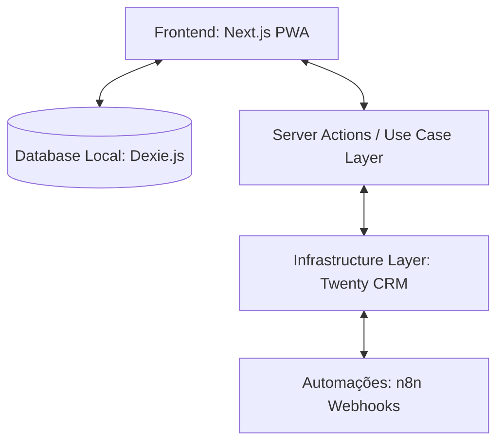
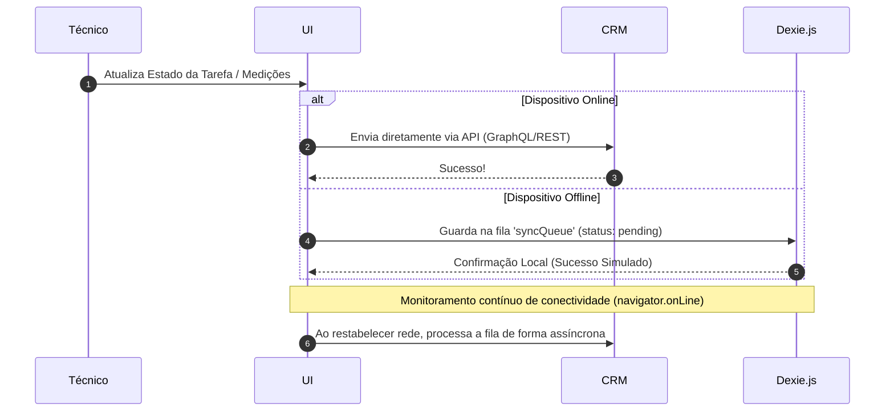

# Estudo de Arquitetura: Habitarmos Técnica

Este documento apresenta uma análise profunda de ponta a ponta (A a Z) da arquitetura, fluxo de dados, segurança, integridade e resiliência offline do sistema **Habitarmos Técnica**.

---

## 1. Visão Geral do Sistema

O **Habitarmos Técnica** é um sistema avançado de Gestão Técnica e Logística desenhado para dispositivos móveis (PWA) e desktops, com foco em técnicos de campo, gestores de armazém e administradores.

Os pilares fundamentais do sistema são:
1. **Fidelidade de Dados Real**: Integração direta com o **Twenty CRM** via GraphQL/REST, eliminando mocks.
2. **Resiliência Offline-First**: Utilização de uma base de dados local robusta com **Dexie.js** (IndexedDB) para operação sem conectividade.
3. **Segurança Rigorosa**: Validação de esquemas com **Zod**, tipos TypeScript gerados de forma preditiva e NextAuth para controle de perfis.



---

## 2. Divisão de Camadas (Clean Architecture)

De acordo com as diretrizes do projeto (`AGENTS.md`), o código está estritamente segregado em três camadas:

| Camada | Localização | Responsabilidade | Restrições |
| :--- | :--- | :--- | :--- |
| **Presentation (Apresentação)** | `src/app/`, `src/components/` | Renderização de telas, gerenciamento de estado local do cliente. | **Proibido** realizar chamadas diretas de banco ou CRM. |
| **Use Case (Ações)** | `src/actions/` | Server Actions do Next.js. Orquestram mutações de dados de forma segura. | Retornam sempre `{ success: boolean, data?: any, error?: string }`. |
| **Infrastructure (Infraestrutura)** | `src/lib/crm/` | Único local que executa queries GraphQL e chamadas REST ao Twenty CRM. | Isolado de qualquer lógica visual ou de estado do cliente. |

---

## 3. Modelo de Dados e Validação de Esquemas (Zod)

Para garantir integridade absoluta do fluxo de dados e evitar problemas em tempo de execução, o sistema centraliza os esquemas de dados em `src/lib/crm/schemas.ts` utilizando **Zod**:

```typescript
export const TaskStatusSchema = z.enum([
  'AGENDADO', 'CONCLUIDO', 'INCOMPLETO', 'CANCELADO',
  'Agendado', 'Concluído', 'Incompleto', 'Cancelado'
]);

export const CRMTaskSchema = z.object({
  id: z.string().uuid(),
  title: z.string(),
  status: TaskStatusSchema,
  dueAt: z.string().or(z.date()),
  moradaDaReparacao: z.object({
    addressStreet1: z.string().optional().nullable(),
    addressCity: z.string().optional().nullable(),
    addressLat: z.number().optional().nullable(),
    addressLng: z.number().optional().nullable(),
  }).optional().nullable(),
  bodyV2: z.object({
    markdown: z.string().optional().nullable(),
  }).optional().nullable(),
  technicianName: z.string().optional().nullable(),
  assigneeId: z.string().uuid().optional().nullable(),
  scheduledBy: z.string().optional().nullable(),
});

export type CRMTask = z.infer<typeof CRMTaskSchema>;
```

---

## 4. O Coração Offline-First: Sincronização Local (Dexie.js & useSyncQueue)

Quando o técnico está em áreas sem cobertura de rede (por exemplo, garagens ou subsolos), o aplicativo não pode falhar. O sistema utiliza o **Dexie.js** para armazenar dados localmente e sincronizá-los em segundo plano.

### Estrutura do Banco Local (`src/lib/db.ts`)
O banco possui duas tabelas principais no IndexedDB:
- `tasks`: Cache de tarefas locais com status de sincronização.
- `syncQueue`: Fila de ações pendentes que precisam ser enviadas para o CRM.

### Fluxo de Atualização com Fila de Sincronização


---

## 5. Autenticação e Segurança Dinâmica

O controle de sessões é feito usando **NextAuth.js** através do `CredentialsProvider`. Ele funciona da seguinte forma:

1. O usuário submete o e-mail e password.
2. O sistema faz uma consulta segura na coleção `appauths` do Twenty CRM.
3. Se o e-mail existir, o sistema verifica o hash da senha usando `bcryptjs`.
4. Os dados retornados (perfil/role: Técnico, Administrador ou Armazém) são codificados no Token JWT e na Sessão para determinar as rotas permitidas.

---

## 6. Integração de Automações com n8n

O projeto possui fluxos complexos de integração utilizando **n8n** (documentados nos arquivos de workflow da raiz, como `workflow_v14_final_corrigido.json` e `workflow_v15_corrigido.json`). 

Estes fluxos tratam de:
- **Notificações em tempo real**: Envio de alertas quando tarefas mudam de estado.
- **Relatórios Automatizados**: Geração de PDFs e envio de e-mails/mensagens de confirmação para os clientes.
- **Geração de Notas**: Agendamentos e sincronização bidirecional automática de dados.

---

## 7. Estrutura do Repositório (A a Z)

```ini
app-tecnicos/
├── .next/                         # Pasta de build e cache do Next.js
├── e2e/                           # Testes End-to-End com Playwright
├── public/                        # Ativos estáticos e manifesto PWA
├── src/
│   ├── actions/                   # Camada de Casos de Uso (Server Actions)
│   │   ├── measurements-actions.ts# Ações para guardar formulários de medição
│   │   ├── notes-actions.ts       # Ações para notas de agendamento
│   │   └── tasks-actions.ts       # Ações para atualizações de tarefas
│   ├── app/                       # Apresentação & Router (Next.js App Router)
│   │   ├── admin/                 # Painel do Administrador (Mapa, Rotas, AI)
│   │   ├── armazem/               # Painel de Logística/Stock
│   │   ├── api/                   # Endpoints de API internos
│   │   └── page.tsx               # Página Inicial (Login/Dashboard)
│   ├── components/                # Componentes Visuais (Tailwind CSS)
│   │   ├── admin/                 # Componentes específicos de administração
│   │   ├── features/              # Funcionalidades dedicadas (ex: Medições)
│   │   └── warehouse/             # Componentes do Armazém
│   ├── hooks/                     # Hooks Customizados de React
│   │   ├── useMeasurements.ts     # Hook para manipulação de medições
│   │   └── useSyncQueue.ts        # Hook principal de sincronização offline
│   ├── lib/                       # Motores centrais e Integração CRM
│   │   ├── crm/                   # Camada de Infraestrutura do Twenty CRM
│   │   │   ├── client.ts          # Cliente GraphQL genérico
│   │   │   ├── tasks.ts           # Consultas e mutações das tarefas
│   │   │   └── schemas.ts         # Schemas Zod e Types
│   │   └── db.ts                  # Configuração do Dexie.js (IndexedDB)
│   └── types/                     # Tipos globais adicionais
├── package.json                   # Dependências e scripts do ecossistema
└── tsconfig.json                  # Configuração do compilador TypeScript
```

---

## 8. Estratégia de Qualidade e QA

O projeto implementa uma abordagem de teste de alta cobertura:
1. **Testes de Integração de API**: Garante que as chamadas GraphQL/REST ao Twenty CRM funcionam mesmo com alterações de tipagem do CRM.
2. **Testes de Fluxo Crítico (Playwright)**: Testes automatizados que simulam o login, perda de conexão (offline), preenchimento de medições, gravação local e sincronização subsequente.
3. **Validação de Produção**: Os erros são reportados de maneira amigável, impedindo falhas gerais de renderização no React (Error Boundaries).
