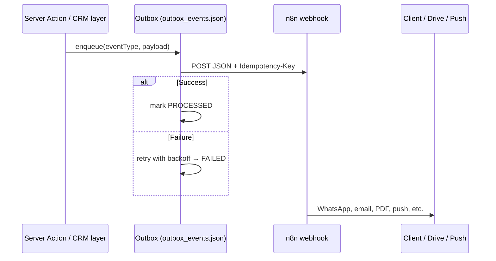
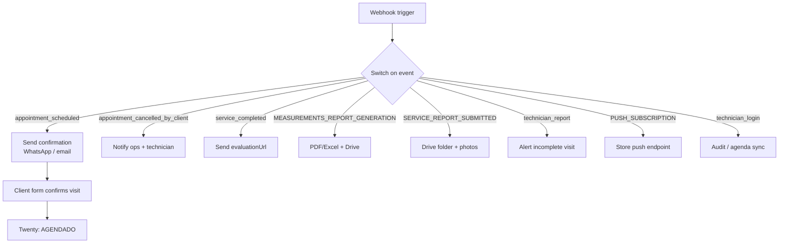

# n8n Integration Guide

This app uses **n8n** for outbound automations: client notifications (WhatsApp, email), PDF/Excel measurement reports, Google Drive folders, technician push alerts, and client visit confirmation flows.

The app **never blocks the UI** on n8n. Events go through a **transactional outbox** (`src/lib/outboxQueue.ts`) with retries, idempotency keys, and dead-letter reprocessing from `/admin/observabilidade`.

> **Security:** Use placeholder URLs in Git. Set real webhook URLs only in the server `.env.local`. See [docs/PRODUCTION_ENV.md](docs/PRODUCTION_ENV.md).

---

## How delivery works



**Routing logic:** `src/lib/n8nWebhooks.ts` (`resolveN8nWebhookUrl`).

**Payload enrichment:** `src/lib/notificationAction.ts` adds `cancelUrl`, `evaluationUrl`, and `baseUrl` to notification events.

---

## Environment variables

Set these in `.env.local` on the server (copy from `.env.example`):

| Variable | Required | Routes |
|----------|----------|--------|
| `N8N_WEBHOOK_URL` | Recommended | General events (login, task status, measurements) |
| `N8N_AGENDAMENTO_WEBHOOK_URL` | **Production scheduling** | `appointment_scheduled`, `appointment_cancelled_by_client` |
| `N8N_WEBHOOK_URL_REPORTS` | Optional | `SERVICE_REPORT_SUBMITTED` |
| `N8N_WEBHOOK_URL_PUSH` | Optional | `PUSH_SUBSCRIPTION` |
| `N8N_FORM_CONFIRM_URL` | Optional | Override for client confirmation form URL |

**Fallback order for scheduling:** `N8N_AGENDAMENTO_WEBHOOK_URL` → `N8N_WEBHOOK_URL` → local test default.

**Form URL derivation:** If `N8N_FORM_CONFIRM_URL` is unset, the E2E suite derives `{scheduling-webhook-origin}/form/confirmar-visita-tecnica`.

**Local dev defaults** (when env vars are empty):

| Default path | Purpose |
|--------------|---------|
| `http://localhost:5678/webhook-test/blinds-notifications` | General notifications |
| `http://localhost:5678/webhook-test/blinds-measurements` | Measurements report |
| `http://localhost:5678/webhook-test/blinds-service-reports` | Service reports |
| `http://localhost:5678/webhook-test/app-push-subscription` | Push subscriptions |

> **Docker production:** n8n runs in a **separate container**. The app container cannot reach `localhost:5678` on the host. You **must** set HTTPS webhook URLs in `.env.local` — see [docs/PRODUCTION_ENV.md](docs/PRODUCTION_ENV.md).

### Production checklist

Copy this block to the server `.env.local` and replace placeholders with your n8n workflow URLs:

```env
N8N_WEBHOOK_URL=https://n8n.yourcompany.com/webhook/general-notifications
N8N_AGENDAMENTO_WEBHOOK_URL=https://n8n.yourcompany.com/webhook/scheduling
N8N_WEBHOOK_URL_REPORTS=https://n8n.yourcompany.com/webhook/service-reports
N8N_WEBHOOK_URL_PUSH=https://n8n.yourcompany.com/webhook/push-subscriptions
N8N_FORM_CONFIRM_URL=https://n8n.yourcompany.com/form/confirm-technical-visit
```

| Step | Action |
|------|--------|
| 1 | Create matching webhook workflows in n8n (POST, JSON body) |
| 2 | Paste URLs into `/root/app-tecnicos/.env.local` |
| 3 | `docker compose up -d --build` in `/root/app-tecnicos` |
| 4 | Fix `technician-nginx` if needed (`docker compose restart nginx`) |
| 5 | `/admin/observabilidade` → reprocess outbox + run E2E suite (depth `full`) |

**Minimum for scheduling only:** `N8N_AGENDAMENTO_WEBHOOK_URL` alone covers visit booking and client cancellation. All other events still need `N8N_WEBHOOK_URL` and `N8N_WEBHOOK_URL_REPORTS`.

---

## Event catalog

All outbox deliveries are **HTTP POST** with `Content-Type: application/json` and an `Idempotency-Key` header. The body includes the payload fields below plus `_outboxId`, `_idempotencyKey`, and `timestamp`.

### Scheduling — `N8N_AGENDAMENTO_WEBHOOK_URL`

| Event | Trigger | Source |
|-------|---------|--------|
| `appointment_scheduled` | Admin schedules a visit (`POR_AGENDAR`) | `src/lib/crm/scheduleVisit.ts` |
| `appointment_cancelled_by_client` | Client cancels via `/cancelamento` | `src/lib/crm/tasks.ts` |

**`appointment_scheduled` payload highlights:**

```json
{
  "event": "appointment_scheduled",
  "taskId": "uuid",
  "opportunityId": "uuid",
  "title": "Measurement visit",
  "dueAt": "2026-09-22T14:00:00.000Z",
  "clientName": "Example Client",
  "address": "123 Example St, Example City",
  "technicianName": "Tech Name",
  "pointOfContactEmail": "client@example.com",
  "scheduledBy": "Admin Name",
  "pendingConfirmation": true,
  "taskStatus": "POR_AGENDAR",
  "cancelUrl": "https://technicians.yourcompany.com/cancelamento/{taskId}?t=…",
  "evaluationUrl": "https://technicians.yourcompany.com/avaliacao/{opportunityId}?t=…",
  "baseUrl": "https://technicians.yourcompany.com"
}
```

**Recommended n8n workflow:**

1. Receive webhook → branch on `event`
2. Send WhatsApp/email with visit details + confirmation link (`N8N_FORM_CONFIRM_URL` or derived form)
3. On client confirmation → update Twenty task to `AGENDADO` and advance opportunity stage
4. Include `cancelUrl` in reminders so clients can self-cancel

---

### General notifications — `N8N_WEBHOOK_URL`

| Event | Trigger | Source |
|-------|---------|--------|
| `technician_login` | User signs in | `src/app/api/auth/[...nextauth]/route.ts` |
| `technician_report` | Task **cancelled** or **incomplete** | `src/lib/crm/tasks.ts` |
| `service_completed` | Task **completed** | `src/lib/crm/tasks.ts` |
| `MEASUREMENTS_REPORT_GENERATION` | Measurements saved on site | `src/lib/crm/measurements.ts` |

**`technician_login` example:**

```json
{
  "event": "technician_login",
  "technician": {
    "email": "technician@example.com",
    "name": "Technician Name"
  }
}
```

**`MEASUREMENTS_REPORT_GENERATION` highlights:** `taskId`, `opportunityId`, `measurements` (room dimensions), `clientName`, `nsi`.

**Recommended workflows:**

- **Login:** audit log, optional manager alert, sync daily agenda from CRM
- **Incomplete/cancelled:** notify sales/ops with `observations` and client email
- **Completed:** send evaluation link (`evaluationUrl`) to client
- **Measurements:** generate PDF/Excel, upload to Google Drive, attach link to CRM note

---

### Service reports — `N8N_WEBHOOK_URL_REPORTS`

| Event | Trigger | Source |
|-------|---------|--------|
| `SERVICE_REPORT_SUBMITTED` | Visit closed (complete or incomplete) | `src/lib/crm/tasks.ts` → `serverTriggerServiceReport` |

Payload includes `photos`, `observations`, `folderMetadata` (`year`, `month`, `day`, `clientName`, `serviceType`, `nsi`, `taskTitle`).

**Recommended workflow:** create Google Drive folder hierarchy → upload photos → write link back to CRM.

---

### Web push — `N8N_WEBHOOK_URL_PUSH`

| Event | Trigger | Source |
|-------|---------|--------|
| `PUSH_SUBSCRIPTION` | Technician opts in via browser | `src/app/api/push/subscribe/route.js` |

Payload: `subscription` (Push API object), `userId`, `userName`.

**Note:** Push delivery bypasses the outbox (direct `fetch` to n8n). Store subscriptions in n8n or CRM and use VAPID keys from `.env.local` (`VAPID_PUBLIC_KEY`, `VAPID_PRIVATE_KEY`) when sending.

---

## Public portal links in payloads

Built in `src/lib/notificationAction.ts` via `src/lib/publicTokens.ts`:

| Field | Portal | Security |
|-------|--------|----------|
| `evaluationUrl` | `/avaliacao/{opportunityId}?t=…` | HMAC token, configurable TTL (`PUBLIC_LINK_TTL_DAYS`, default 30) |
| `cancelUrl` | `/cancelamento/{taskId}?t=…` | HMAC token, same TTL |

n8n workflows should **forward these URLs** to clients — do not rebuild them manually.

---

## Recommended n8n workflow map



---

## Testing & observability

| Method | Action |
|--------|--------|
| **UI** | `/admin/observabilidade` → **Run Complete E2E Suite** (safe) or **Full (live n8n)** |
| **API** | `POST /api/qa` with `{ "mode": "E2E_FULL_SUITE", "depth": "safe" \| "full" }` |
| **Luxury E2E** | Full business simulation — triggers all event types (opt-in, creates real CRM data) |

Relevant checks: `env-scheduling-webhook`, `n8n-webhook-routing`, `n8n-scheduling-webhook-live`, `n8n-form-endpoint-live`, `outbox-queue-health`.

See [docs/E2E_OBSERVABILITY_SUITE.md](docs/E2E_OBSERVABILITY_SUITE.md).

**Manual smoke test:**

1. Set webhook URLs in `.env.local`
2. `npm run dev`
3. Schedule a visit in `/admin` → verify n8n execution for `appointment_scheduled`
4. Log in as technician → verify `technician_login`
5. Check `/admin/observabilidade` outbox panel for FAILED events

---

## Troubleshooting

| Symptom | Likely cause | Fix |
|---------|--------------|-----|
| No webhook fired | Env var missing | Set `N8N_*` on server; rebuild Docker if `NEXT_PUBLIC_*` changed |
| Scheduling events on wrong workflow | Routing | Use `N8N_AGENDAMENTO_WEBHOOK_URL` for scheduling |
| Events stuck PENDING | Empty `N8N_*` in Docker / localhost fallback | Set HTTPS URLs in `.env.local`; rebuild; reprocess outbox |
| `technician-nginx` restart loop | Duplicate nginx directive | Keep single `proxy_read_timeout` per `location` block in `nginx/nginx.conf` |
| Form check fails | Form not published | Set `N8N_FORM_CONFIRM_URL` or publish `/form/confirmar-visita-tecnica` |
| Duplicate messages | n8n retry + app retry | Honor `Idempotency-Key` in n8n |

---

## Security

- Use **HTTPS** webhook URLs in production
- Validate payload shape in n8n before side effects
- Do not log full HMAC tokens in n8n execution logs
- Consider webhook authentication (header secret) — not enforced by the app today; validate in n8n if added
- Keep `PUBLIC_LINK_SECRET` or `NEXTAUTH_SECRET` stable — rotating invalidates outstanding portal links

---

## Related docs

- [README.md](README.md) — project overview
- [docs/END_TO_END_BUSINESS_FLOW.md](docs/END_TO_END_BUSINESS_FLOW.md) — full business lifecycle
- [TWENTY_CRM_SETUP.md](TWENTY_CRM_SETUP.md) — CRM field mapping
- [docs/PRODUCTION_ENV.md](docs/PRODUCTION_ENV.md) — server-only configuration
