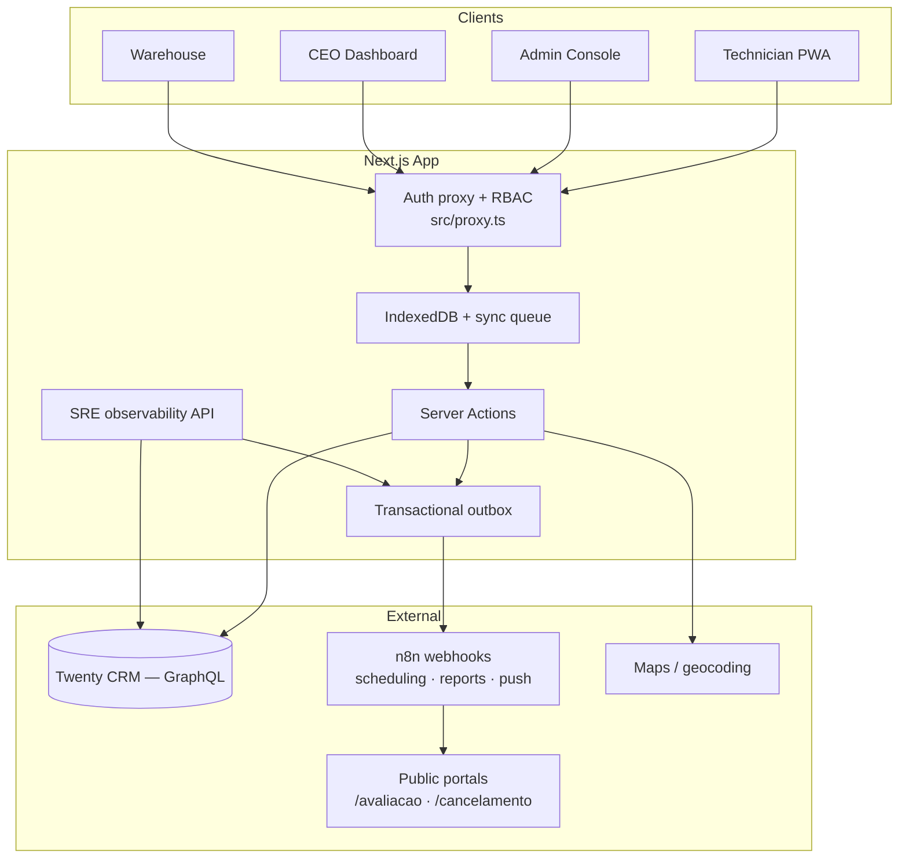
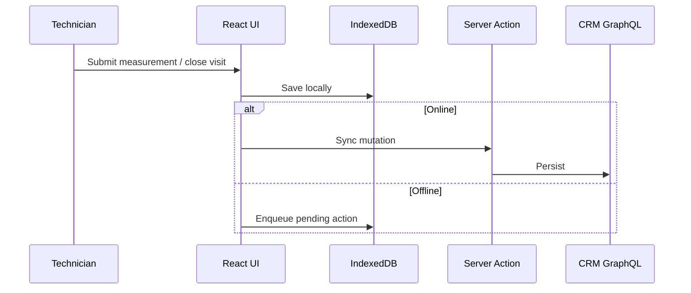

# Blinds Technical Services — Field Operations Platform

A production-grade **Progressive Web App** for blinds installation companies: scheduling, field work, warehouse prep, executive analytics, and customer self-service — synchronized with **Twenty CRM** and built **offline-first** for technicians on the road.

> Branding is env-driven (`NEXT_PUBLIC_APP_NAME`, `NEXT_PUBLIC_APP_SHORT_NAME`). Defaults in `.env.example` are generic placeholders — override on the production server.

---

## Table of contents

1. [Why we built this](#why-we-built-this)
2. [Features](#features)
3. [Integrations](#integrations)
4. [Architecture](#architecture)
5. [Tech stack](#tech-stack)
6. [Getting started](#getting-started)
7. [Project structure](#project-structure)
8. [Documentation](#documentation)

---

## Why we built this

### Problem

A blinds company serving **more than 15,000 customers** was stuck in organizational chaos.

- Customers called every day: *Where is my order? When will materials arrive? When can a technician visit?*
- **Hundreds of hours per month** were lost on phone calls, chats, and manual status checks.
- Route planning, travel spend, fuel, tolls, and stock were tracked in spreadsheets — or not at all.
- Departments worked on **paper and siloed tools**. When someone needed an answer, no one had the full picture.
- Data died between **sales, scheduling, warehouse, field teams, and leadership**.

### Solution

**Blinds Technical Services** connects the full lifecycle in one platform:

| Role | Capability |
|------|------------|
| **CEO** | Revenue, pipeline forecast, technician rankings, fleet km, NPS, follow-ups |
| **Admin** | Full operational panel + SRE observability |
| **Member** | Operational admin (map, calendar, scheduling) — no CEO or SRE console |
| **Technicians (PWA)** | Day agenda, GPS, millimetre measurements, visit closure — **offline-first** |
| **Warehouse** | Per-item preparation status before installation |
| **Customers** | HMAC-signed links to rate a service or cancel an appointment |

All roles sync with **Twenty CRM**. Pipeline workflow is **stage-first** (`ENTRADA`, `MANUTENCAO`, `REPARACAO`, `MARCAR_INSTALACAO`, etc.) — the app derives visit type from **opportunity stage + title**, not a separate service-type field. Offline mutations queue in IndexedDB and replay when connectivity returns.

### Impact

- Single source of truth from **lead → measurement → install → payment**
- Fewer inbound calls — status lives in CRM and surfaces on the right screen
- Measurable logistics: optimized routes, cost estimates, zone insights
- Field teams stop re-typing; warehouse prepares before vans leave
- Leadership sees live metrics instead of month-end guesses

---

## Features

### Technician mobile PWA

- Offline task list with IndexedDB sync queue and retry jitter
- On-site states: scheduled → in progress → complete / incomplete / cancelled
- Product-group measurement forms
- One-tap navigation (Google Maps / Waze)
- Sync telemetry for operations monitoring

### Admin control center

- Map: unscheduled vs scheduled visits, overdue indicators, live technician pins
- Filters: measurements, installations, and **assistance** (maintenance / repair)
- Calendar per technician
- AI route strategy with fuel/toll estimates
- Mass scheduling, opportunity drawer, automatic geocoding
- Service history API with **50 items per page**

### CEO executive dashboard

- Won revenue, pipeline, weighted forecast, win rate
- Monthly evolution & funnel by stage
- Technician success rate and estimated km
- Customer ratings and follow-up urgency
- **Year-filtered CRM queries** (server-side date filters)

### Warehouse

- Service items linked to opportunities
- Preparation workflow before installation

### SRE observability *(admin role only)*

- CRM latency & circuit breaker
- Transactional outbox (pending / failed / reprocess)
- **Complete E2E Suite** — CRM, n8n routing, outbox, public portals, app health
- **Luxury Workflow E2E** — full business simulation with real CRM records (opt-in)
- Offline sync telemetry per technician
- QA 360 diagnostic runner

### Public customer portals

- Service rating — signed expiring token (`/avaliacao/{id}?t=…`)
- Appointment cancellation — token + state guard (`/cancelamento/{id}?t=…`)

### Engineering quality

- Zod schemas, clean architecture (UI → actions → CRM layer)
- Single CRM contract in `src/lib/crm/contract.ts` (stages, transitions, RBAC helpers)
- Circuit breaker, transactional outbox, **86+** unit tests, Playwright e2e
- GitHub Actions CI: type-check, test, build, smoke e2e
- RBAC: **admin**, **member**, **ceo**, **technician**, **warehouse**

---

## Integrations

| System | Role |
|--------|------|
| **Twenty CRM** | GraphQL source of truth — opportunities, tasks, measurements, roles |
| **n8n** | Outbound automations — WhatsApp, email, PDF/Excel reports, Google Drive, push |
| **Google Maps** | Geocoding and navigation (optional `NEXT_PUBLIC_GOOGLE_MAPS_API_KEY`) |
| **Web Push (VAPID)** | Technician visit alerts via service worker + n8n |

### n8n automations

The UI never calls n8n directly. Server events are written to a **transactional outbox** (`src/lib/outboxQueue.ts`), then delivered with HTTP POST, retries, and `Idempotency-Key` headers. Failed deliveries can be reprocessed from `/admin/observabilidade`.

| Env variable | Events routed here |
|--------------|-------------------|
| `N8N_WEBHOOK_URL` | `technician_login`, `technician_report`, `service_completed`, `MEASUREMENTS_REPORT_GENERATION` |
| `N8N_AGENDAMENTO_WEBHOOK_URL` | `appointment_scheduled`, `appointment_cancelled_by_client` |
| `N8N_WEBHOOK_URL_REPORTS` | `SERVICE_REPORT_SUBMITTED` (photos + Drive folder metadata) |
| `N8N_WEBHOOK_URL_PUSH` | `PUSH_SUBSCRIPTION` (browser push opt-in) |
| `N8N_FORM_CONFIRM_URL` | Optional override for the client visit confirmation form |

Scheduling payloads include HMAC-signed `cancelUrl` and `evaluationUrl` for the public portals (`/cancelamento`, `/avaliacao`).

**Setup:** [N8N_SETUP.md](N8N_SETUP.md) · **Validate:** [docs/E2E_OBSERVABILITY_SUITE.md](docs/E2E_OBSERVABILITY_SUITE.md) · **Business flow:** [docs/END_TO_END_BUSINESS_FLOW.md](docs/END_TO_END_BUSINESS_FLOW.md)

---

## Architecture



**Offline sync**



---

## Tech stack

| Layer | Technology |
|-------|------------|
| Framework | Next.js 16, React 19 |
| Language | TypeScript, Zod |
| Styling | Tailwind CSS v4 |
| Local data | Dexie.js (IndexedDB) |
| CRM | Twenty (GraphQL + contract layer) |
| Auth | NextAuth.js, JWT, RBAC |
| Automation | n8n webhooks |
| Tests | Vitest (86+), Playwright |
| Deploy | Docker Compose, Nginx |

---

## Getting started

### Prerequisites

- Node.js 20+
- Twenty CRM instance + API key

### Install

```bash
git clone https://github.com/alyekseyenko/services-blinds.git
cd services-blinds
npm install
```

### Environment

```bash
cp .env.example .env.local
```

Copy `.env.example` and set at least:

| Variable | Purpose |
|----------|---------|
| `TWENTY_API_URL` / `TWENTY_API_KEY` | Twenty CRM GraphQL |
| `NEXTAUTH_SECRET` / `NEXTAUTH_URL` | Session auth (32+ char secret) |
| `NEXT_PUBLIC_APP_URL` | Public app URL (portal links, n8n payloads) |
| `NEXT_PUBLIC_APP_NAME` / `NEXT_PUBLIC_APP_SHORT_NAME` | Branding |

**Optional — n8n automations** (leave empty for local dev only; **required in Docker production**):

| Variable | Purpose |
|----------|---------|
| `N8N_WEBHOOK_URL` | General notifications (login, task status, measurements) |
| `N8N_AGENDAMENTO_WEBHOOK_URL` | Scheduling + client cancellation |
| `N8N_WEBHOOK_URL_REPORTS` | Service reports with photos |
| `N8N_WEBHOOK_URL_PUSH` | Web push subscription registry |
| `N8N_FORM_CONFIRM_URL` | Client visit confirmation form (optional override) |

See [N8N_SETUP.md](N8N_SETUP.md) for placeholders and [docs/PRODUCTION_ENV.md](docs/PRODUCTION_ENV.md) for server setup.

Production values live **only on the server** — see [docs/PRODUCTION_ENV.md](docs/PRODUCTION_ENV.md). Never commit `.env.local`.

### Commands

```bash
npm run dev         # development server
npm run validate    # type-check + unit tests
npm run test:e2e:smoke
npm run build       # production build
```

---

## Project structure

```
src/
├── actions/              # Server Actions (use cases)
├── app/
│   ├── admin/            # Map, calendar, history, observability
│   ├── ceo/              # Executive dashboard
│   ├── dashboard/        # Technician PWA
│   ├── armazem/          # Warehouse
│   ├── avaliacao/        # Public rating portal
│   └── cancelamento/     # Public cancellation portal
├── components/
├── hooks/                # useSync, useSyncQueue
├── lib/crm/              # GraphQL integration + contract layer (stages, transitions)
└── proxy.ts              # Next.js 16 auth + route RBAC (not middleware.ts)
docs/adrs/                # Architecture decision records
```

---

## Documentation

| Doc | Contents |
|-----|----------|
| [ARCHITECTURE_MASTER_BLUEPRINT.md](ARCHITECTURE_MASTER_BLUEPRINT.md) | System design overview |
| [DESIGN_SYSTEM.md](DESIGN_SYSTEM.md) | UI tokens, glassmorphism, mobile PWA rules |
| [N8N_SETUP.md](N8N_SETUP.md) | Webhook URLs, event catalog, recommended workflows |
| [docs/END_TO_END_BUSINESS_FLOW.md](docs/END_TO_END_BUSINESS_FLOW.md) | Full lifecycle: CRM stages → field → n8n |
| [docs/E2E_OBSERVABILITY_SUITE.md](docs/E2E_OBSERVABILITY_SUITE.md) | SRE checks, Luxury Workflow E2E |
| [docs/PRODUCTION_ENV.md](docs/PRODUCTION_ENV.md) | Server-only env vars (no secrets in Git) |
| [TWENTY_CRM_SETUP.md](TWENTY_CRM_SETUP.md) | Twenty CRM fields and API setup |
| [DEPLOY_HETZNER.md](DEPLOY_HETZNER.md) | Docker Compose deployment |
| [docs/adrs/](docs/adrs/) | Architecture decision records |
| [AGENTS.md](AGENTS.md) | AI agent / contributor guidelines |

---

## Security & privacy (GitHub)

- **Never commit** `.env.local` — it holds API keys, secrets, and real domains.
- The repo uses **placeholders** for secrets, domains, and branding (`your_api_key`, `yourcompany.com`, `Blinds Technical Services`) — no production URLs, client names, or API keys in Git.
- Production branding and URLs are set **only on the server** — see [docs/PRODUCTION_ENV.md](docs/PRODUCTION_ENV.md).
- Keep the repository **Private** if you want extra protection.
- Deploy and ops tooling stay **outside Git** — production secrets and server access are never published.

---

## License

Private — all rights reserved.
