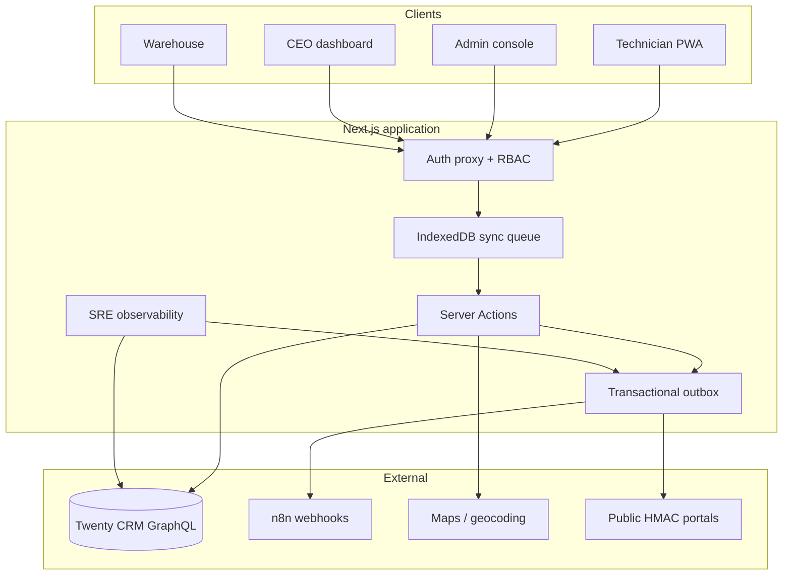
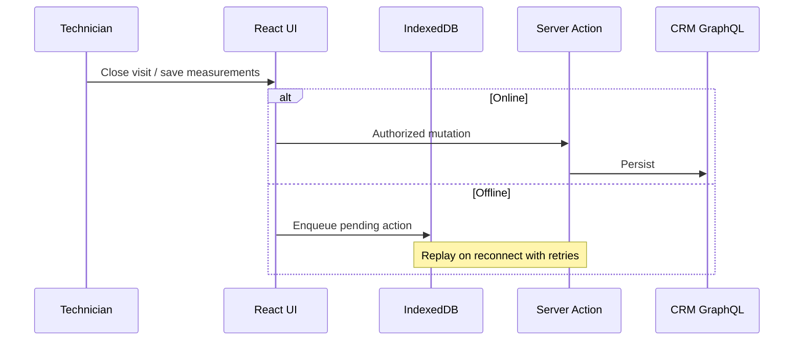

# Blinds Technical Services — Field Operations Platform

[](https://github.com/alyekseyenko/services-blinds/actions/workflows/ci.yml)


**Production-grade PWA** for field-service teams (scheduling, measurements, warehouse prep, executive analytics, customer self-service). Syncs with **Twenty CRM** over GraphQL. Built **offline-first** for technicians on unreliable mobile networks.

> Portfolio / case-study repository. Branding, domains, and secrets are **placeholders** in Git; real values live only on the deployment server (see [Security](#security--privacy)).

---

## At a glance (for recruiters)

| Dimension | What this project demonstrates |
|-----------|--------------------------------|
| **Product** | Multi-role B2B ops tool (~20 concurrent users): technicians, warehouse, ops admin, CEO, SRE |
| **Reliability** | Offline IndexedDB queue, transactional outbox to automations, circuit breaker on CRM |
| **Architecture** | Layered design: UI → Server Actions → `lib/crm` (infra only), Zod at boundaries |
| **Security** | JWT + RBAC, HMAC public portals, session-scoped APIs, no CRM mutations from client bundles |
| **Ops** | Docker production deploy, SRE dashboard, extensible E2E health registry, CI on every push |
| **Quality** | 169+ Vitest unit tests, Playwright smoke E2E, TypeScript strict, GitHub Actions pipeline |

---

## Skills highlighted

**Frontend & mobile**

- Next.js 16 App Router, React 19, Server Actions, route-level auth (`src/proxy.ts`)
- PWA: service worker, install prompts, push opt-in
- Tailwind CSS v4, responsive / touch-first UI (48px targets, field workflows)
- Google Maps: clustering, geocoding, live technician map (admin)

**Backend & integration**

- TypeScript end-to-end, **Zod** schemas as single source of truth (`z.infer` types)
- Twenty CRM **GraphQL** client with retries, timeouts, **circuit breaker**
- **Transactional outbox** → n8n webhooks (idempotency keys, dead-letter, background drain)
- NextAuth.js (JWT), role helpers (`admin` / `member` / `ceo` / `technician` / `warehouse`)
- Redis-backed CRM cache (optional), file-backed durable state on Docker volume

**Data & offline**

- **Dexie (IndexedDB)** sync queue: ordering, retries, multi-tab lock, sync telemetry
- Domain contract layer: CRM stages, task status, scheduling rules (`src/lib/crm/contract.ts`)

**Testing & delivery**

- Vitest (domain + integration-style unit tests), Playwright (smoke + task flows)
- `npm run validate` = type-check + tests; CI: lint (advisory), build, E2E smoke
- Docker multi-stage image, Compose stack, host nginx TLS (documented, not tied to one vendor)

**Architecture & process**

- Spec-driven / DDD-style boundaries, ADRs in `docs/adrs/`
- Observability suite: CRM latency, outbox stats, n8n routing checks, optional “luxury” business E2E
- Env-driven branding — safe defaults for open-source portfolio (`src/lib/branding.ts`)

---

## Architecture choices (and why)

| Decision | Rationale |
|----------|-----------|
| **Offline-first queue (client)** | Field users lose signal often; UI stays usable; mutations replay with explicit failure states ([ADR 002](docs/adrs/002-offline-queue.md)). |
| **Server Actions as use-case layer** | Thin mutations with `{ success, data?, error? }`; CRM access only in `src/lib/crm/*` with `server-only`. |
| **CRM contract module** | Twenty field names and pipeline stages centralized — UI and tests depend on domain helpers, not raw API strings. |
| **Transactional outbox (server)** | CRM commit and n8n notification decoupled; retries and SRE reprocess without double-charging the UI thread. |
| **Circuit breaker on CRM** | Prevents cascade when GraphQL is slow; shared failure mode for all users. |
| **Stage-first workflow** | Visit type derived from opportunity **stage + title**, not a duplicate “service type” field — fewer sync bugs. |
| **Public portals with HMAC tokens** | Rating / cancellation without login; expiring, scoped links ([ADR 003](docs/adrs/003-public-portal-tokens.md)). |
| **RBAC at proxy + actions** | Route middleware for pages/APIs; resource checks (e.g. task assignee) in actions — defense in depth. |
| **Next.js 16 `proxy.ts` (not legacy middleware)** | Central auth matcher aligned with this codebase’s Next version. |



**Offline sync (simplified)**



---

## Problem → solution (business context)

A mid-size **blinds / shading installation** company ran scheduling, warehouse, and field work across spreadsheets and phone calls. This platform unifies:

| Role | Capability |
|------|------------|
| **Technicians** | Day agenda, GPS, mm-precise measurements, visit closure — **offline-capable** |
| **Warehouse** | Per-item preparation before install |
| **Ops (admin / member)** | Map, calendar, mass scheduling, route hints, history |
| **CEO** | Revenue, pipeline, technician performance, NPS-style feedback |
| **Customers** | Signed links to rate a visit or cancel (no account) |
| **SRE (admin)** | Health checks, outbox, CRM breaker, sync telemetry |

Impact themes: single source of truth in CRM, fewer status calls, measurable routes/zones, leadership metrics without month-end spreadsheets.

---

## Feature map (engineering view)

- **Technician PWA** — `useSyncQueue`, measurement forms, visit state machine, sync telemetry  
- **Admin** — map filters, clustering, calendar, mass schedule, opportunity drawer, geocoding  
- **CEO** — aggregated CRM metrics with server-side date filters  
- **Warehouse** — preparation workflow tied to opportunities  
- **Observability** — pluggable E2E registry (`src/lib/observability/`), luxury workflow simulator (opt-in)  
- **Automations** — event catalog via env-routed n8n webhooks ([N8N_SETUP.md](N8N_SETUP.md))

---

## Tech stack

| Layer | Choices |
|-------|---------|
| App | Next.js 16, React 19, TypeScript |
| Validation | Zod |
| Styling | Tailwind CSS v4 |
| Client persistence | Dexie / IndexedDB |
| Auth | NextAuth.js, JWT, custom RBAC |
| CRM | Twenty (GraphQL) |
| Cache / queue | Redis (optional), file outbox on volume |
| Automation | n8n (HTTP webhooks) |
| Tests | Vitest, Playwright |
| CI/CD | GitHub Actions |
| Runtime | Node 20, Docker Compose |

---

## Getting started (local)

**Prerequisites:** Node 20+, a Twenty CRM instance (or mock URL for UI-only exploration).

```bash
git clone https://github.com/alyekseyenko/services-blinds.git
cd services-blinds
npm install
cp .env.example .env.local   # fill TWENTY_* and NEXTAUTH_* — never commit this file
npm run dev
```

| Command | Purpose |
|---------|---------|
| `npm run validate` | Type-check + unit tests |
| `npm run test:e2e:smoke` | Playwright smoke (login path) |
| `npm run build` | Production build |

Full env reference: [.env.example](.env.example) · Production-only vars: [docs/PRODUCTION_ENV.md](docs/PRODUCTION_ENV.md)

---

## Repository layout

```
src/
├── actions/           # Server Actions (authorized use cases)
├── app/               # Routes: dashboard, admin, ceo, armazem, public portals, API
├── components/        # UI by domain
├── hooks/             # useSyncQueue, useMeasurements, map helpers
├── lib/crm/           # GraphQL + domain contract (server-only)
├── lib/observability/ # SRE checks & E2E registry
└── proxy.ts           # Auth + RBAC matcher (Next.js 16)
docs/adrs/             # Architecture decision records
```

---

## Further reading

| Document | Topic |
|----------|--------|
| [ARCHITECTURE_MASTER_BLUEPRINT.md](ARCHITECTURE_MASTER_BLUEPRINT.md) | Deep system design |
| [DESIGN_SYSTEM.md](DESIGN_SYSTEM.md) | UI tokens & PWA UX rules |
| [N8N_SETUP.md](N8N_SETUP.md) | Webhook events & env routing |
| [docs/E2E_OBSERVABILITY_SUITE.md](docs/E2E_OBSERVABILITY_SUITE.md) | SRE checks |
| [docs/END_TO_END_BUSINESS_FLOW.md](docs/END_TO_END_BUSINESS_FLOW.md) | CRM stages → field → automation |
| [TWENTY_CRM_SETUP.md](TWENTY_CRM_SETUP.md) | CRM field mapping |
| [DEPLOY_HETZNER.md](DEPLOY_HETZNER.md) | Docker / VPS deployment pattern |
| [AGENTS.md](AGENTS.md) | Contributor & agent guidelines |

---

## Security & privacy

- **Do not commit** `.env.local` — API keys, `NEXTAUTH_SECRET`, and production URLs belong on the server only.
- This public repo uses **generic placeholders** (`yourcompany.com`, sample keys in CI).
- Customer-facing copy in the product is **Portuguese (Portugal)**; this README is English for an international audience.
- Deploy scripts and server credentials are **intentionally excluded** from Git (see `.gitignore`).

---

## License

All rights reserved — portfolio / demonstration source. Not licensed for commercial reuse without permission.
