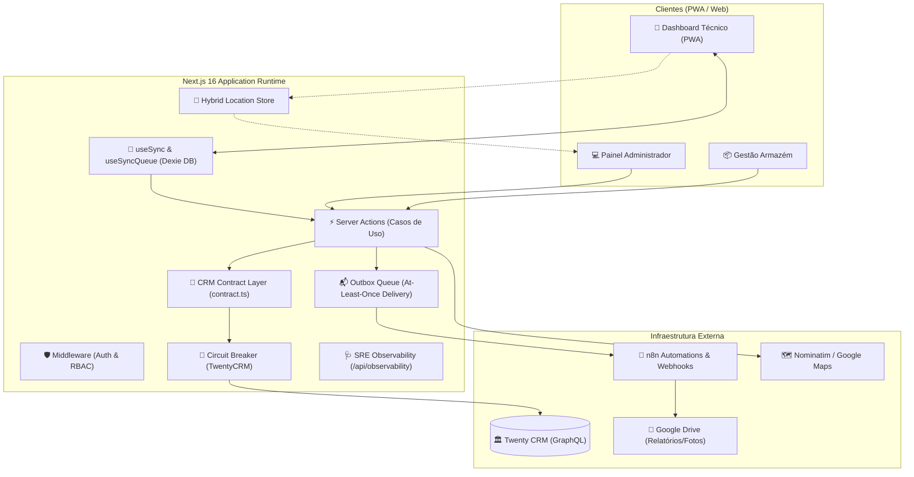
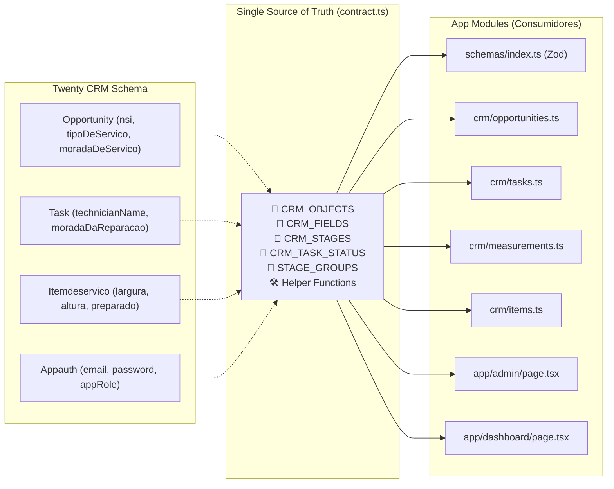
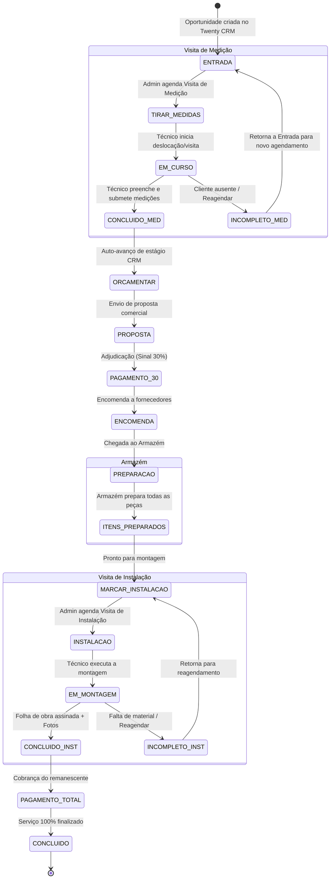
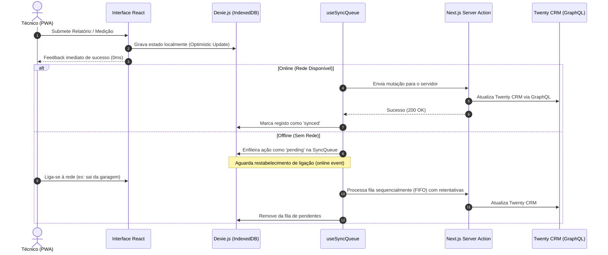
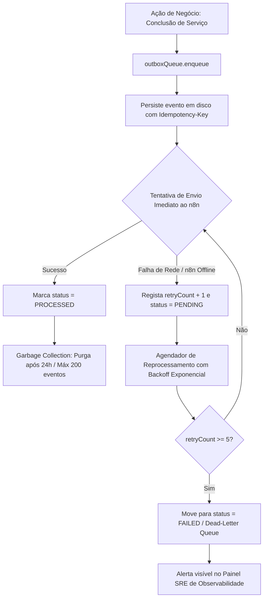

# 🌟 Habitarmos Técnica — Enterprise WebApp & Field Operations

Plataforma avançada de **Gestão Técnica, Logística e IA Cognitiva** desenvolvida para a **Habitarmos**.
A aplicação unifica o trabalho de Administradores, Técnicos no terreno e Armazém com operação **Offline-First**, **Circuit Breaker**, **Transactional Outbox**, **Contrato Desacoplado do Twenty CRM** e **Painel SRE de Observabilidade 24/7**.

---

## 📑 Índice
1. [Visão Geral & Funcionalidades](#-funcionalidades-principais)
2. [Diagramas de Arquitetura](#-diagramas-de-arquitetura)
   - [2.1 Visão Global do Sistema](#21-visão-global-do-sistema)
   - [2.2 Camada de Contrato CRM (Desacoplamento)](#22-camada-de-contrato-crm-desacoplamento)
   - [2.3 Máquina de Estados & Ciclo de Vida do Serviço](#23-máquina-de-estados--ciclo-de-vida-do-serviço)
   - [2.4 Pipeline Offline-First & Fila de Sincronização](#24-pipeline-offline-first--fila-de-sincronização)
   - [2.5 Fila Transacional Outbox & Retentativas](#25-fila-transacional-outbox--retentativas)
3. [Tech Stack](#-tech-stack)
4. [Segurança & RGPD](#-segurança--conformidade-rgpd)
5. [Instalação & Configuração](#-instalação-e-configuração)
6. [Comandos & Testes](#-comandos-disponíveis)
7. [Observabilidade & Diagnóstico SRE](#-observabilidade--painel-sre-247)
8. [Estrutura de Ficheiros](#-estrutura-de-ficheiros)

---

## 🚀 Funcionalidades Principais

- **Modo Offline-First Resiliente (`Dexie.js` + `useSyncQueue`)**: Os técnicos operam em garagens e zonas sem rede sem perder dados. As alterações são guardadas localmente no IndexedDB e sincronizadas automaticamente em segundo plano com optimistic updates.
- **Camada de Contrato CRM Centralizada (`src/lib/crm/contract.ts`)**: Elimina strings hardcoded e desacopla a aplicação do esquema do Twenty CRM. Qualquer alteração de tabelas ou campos no CRM é configurada em apenas 1 ficheiro.
- **Painel de Controlo do Administrador**: Planeamento de rotas com IA, cálculo de custos logísticos/portagens, agendamento em lote, gestão de mapa interativo e calendário em tempo real.
- **Dashboard Móvel do Técnico (PWA)**: Interface focada no trabalho diário (Agenda do Dia, Histórico, Navegação GPS direta via Waze/Google Maps e formulário de medições milimétricas).
- **Rastreio GPS em Tempo Real com RGPD**: Monitorização em tempo real de técnicos ativos com proteção automática de privacidade (pausa de almoço 13h-14h e horário noturno 22h-07h).
- **Gestão de Armazém**: Controlo do estado de preparação de encomendas por peça e comunicação direta com a equipa de montagem.
- **Transactional Outbox Pattern**: Garantia de entrega *At-Least-Once* de notificações WhatsApp/Email e relatórios fotográficos enviados para o n8n e Google Drive, com retenção automática e prevenção de crescimento infinito.
- **Circuit Breaker & Auto-Recuperação**: Proteção contra quebras do CRM que isola falhas temporárias em 0ms e recupera automaticamente com pedidos *canary* em modo `HALF_OPEN`.

---

## 📐 Diagramas de Arquitetura

### 2.1 Visão Global do Sistema



---

### 2.2 Camada de Contrato CRM (Desacoplamento)

Centraliza tabelas, campos custom, estágios e enums para garantir que mudanças no Twenty CRM nunca quebram o código da aplicação.



---

### 2.3 Máquina de Estados & Ciclo de Vida do Serviço

Fluxo completo de uma intervenção técnica desde a entrada até ao encerramento:



---

### 2.4 Pipeline Offline-First & Fila de Sincronização

Garante funcionamento contínuo no terreno sem dependência de conectividade constante:



---

### 2.5 Fila Transacional Outbox & Retentativas

Proteção contra perda de notificações e relatórios enviando eventos de forma assíncrona garantida:



---

## 💻 Tech Stack

| Camada | Tecnologia | Detalhes |
|---|---|---|
| **Framework** | Next.js 16 (App Router), React 19 | Server Actions, Streaming SSR, PWA Ready |
| **Linguagem** | TypeScript 5.x | Tipagem estrita, sem `any` |
| **Estilos** | Tailwind CSS v4 | Dark mode slate, Neon Lime (`#a3e635`), Glassmorphism |
| **Base de Dados Local** | Dexie.js (IndexedDB) | Cache offline, filas de sincronização |
| **CRM** | Twenty CRM | Integração GraphQL com Circuit Breaker e Contract Layer |
| **Automatizações** | n8n | Webhooks com Idempotência para WhatsApp/Email/PDF |
| **Autenticação** | NextAuth.js | Credentials, bcryptjs (salt 10), JWT com RBAC |
| **Geocodificação** | Cascata Nominatim → Google Places | Otimização de custos com geocoding grátis prioritário |
| **Observabilidade** | SRE Engine Interno | Métricas de latência, Circuit Breaker, Outbox, Logs estruturados |
| **Testes** | Vitest & Playwright | Testes unitários de domínio e fluxos E2E |

---

## 🔒 Segurança & Conformidade RGPD

- **RBAC Estrito:** Middleware interceta acessos não autorizados (`401/403`) nas páginas e em todas as rotas `/api/*`.
- **Proteção Criptográfica:** Passwords armazenadas com `bcryptjs` (custo 10); sessões assinadas com `NEXTAUTH_SECRET`.
- **RGPD Geofencing:** Rastreio de localização ativo exclusivamente mediante consentimento explícito, suspenso automaticamente durante a pausa de almoço (13h-14h) e fora do horário de expediente (22h-07h fuso horário de Lisboa).
- **Limpeza de Sessão:** Ao fazer logout ou fechar a aba, a posição GPS do técnico é imediatamente removida do mapa de administração via `navigator.sendBeacon`.
- **Cabeçalhos de Segurança HTTP:** HSTS (2 anos), `X-Frame-Options: DENY`, `X-Content-Type-Options: nosniff`, `Referrer-Policy: strict-origin-when-cross-origin`.

---

## 🛠️ Instalação e Configuração

### Pré-requisitos
- [Node.js](https://nodejs.org/) v20+ ou v22+
- Instância do Twenty CRM ativa com API Key

### 1. Clonar e Instalar Dependências
```bash
git clone <url-do-repositorio>
cd app-tecnicos
npm install
```

### 2. Configurar Variáveis de Ambiente
Cria o ficheiro `.env.local`:
```env
# Twenty CRM (Obrigatório)
TWENTY_API_URL=http://<ip-ou-dominio-twenty>:3000
TWENTY_API_KEY=eyJhbGciOi...

# NextAuth Segurança (Obrigatório)
NEXTAUTH_SECRET=uma_chave_secreta_com_pelo_menos_32_caracteres_aleatorios
NEXTAUTH_URL=http://localhost:3000
NEXT_PUBLIC_APP_URL=http://localhost:3000

# Google Maps (Opcional - tem fallback gratuito via Nominatim)
NEXT_PUBLIC_GOOGLE_MAPS_API_KEY=AIzaSy...

# n8n Automations (Opcional)
N8N_WEBHOOK_URL=http://localhost:5678/webhook-test/habitarmos-notifications
N8N_WEBHOOK_URL_REPORTS=http://localhost:5678/webhook-test/habitarmos-service-reports
```

### 3. Iniciar Servidor de Desenvolvimento
```bash
npm run dev
```
Acede a [http://localhost:3000](http://localhost:3000).

---

## 🧪 Comandos Disponíveis

```bash
# Servidor de desenvolvimento
npm run dev

# Executar suite completa de testes unitários (Vitest)
npm run test

# Executar testes em modo contínuo (Watch)
npm run test:watch

# Executar testes end-to-end (Playwright)
npm run test:e2e

# Verificação estrita de tipos TypeScript
npm run type-check

# Build de produção otimizado
npm run build

# Iniciar servidor em modo de produção
npm run start
```

---

## 🩺 Observabilidade & Painel SRE 24/7

Acede ao painel de telemetria em tempo real em:
👉 **`http://localhost:3000/admin/observabilidade`**

### O Painel Monitoriza:
1. **Conectividade & Latência do Twenty CRM:** Estado da ligação, tempo de resposta em milissegundos e estado do Circuit Breaker (`CLOSED`, `OPEN`, `HALF_OPEN`).
2. **Estado da Fila Outbox:** Contagem de mensagens entregues, pendentes e falhadas com botão de reprocessamento manual.
3. **Tracking de Técnicos Ativos:** Técnicos com telemetria GPS nos últimos 5 minutos.
4. **Cache Semântico de IA & Motor Cognitivo:** Eficiência de cache de rotas e insights operacionais.
5. **Histórico de Logs Estruturados:** Visualização dos últimos 50 eventos do sistema com filtros por severidade (`ERROR`, `WARN`, `INFO`, `DEBUG`).

---

## 📁 Estrutura de Ficheiros

```
src/
├── actions/                  # Server Actions (Casos de Uso failsafe)
│   ├── notes-actions.ts      # Gestão de notas de serviço
│   └── tasks-actions.ts      # Mutações de tarefas e estados
├── app/                      # Camada de Apresentação (App Router)
│   ├── admin/                # Dashboard Admin, Rotas, Calendário
│   │   └── observabilidade/  # Painel SRE de Saúde do Sistema
│   ├── armazem/              # Controlo e Preparação de Encomendas
│   ├── dashboard/            # Dashboard Mobile PWA do Técnico
│   ├── avaliacao/[id]/       # Portal Público de Avaliação do Cliente
│   ├── cancelamento/[id]/    # Portal Público de Cancelamento
│   └── api/                  # Endpoints REST protegidos
│       ├── health/           # Healthcheck para balanceadores de carga
│       ├── location/         # Ingestão de GPS com rate-limit e RGPD
│       ├── members/          # Lista de técnicos e colaboradores
│       ├── observability/    # API de métricas SRE e ações de recuperação
│       ├── opportunities/    # Sincronização e geocoding automático
│       └── tasks/            # Tarefas do técnico e atualizações de status
├── components/               # Componentes React
│   ├── admin/                # Drawers, Modais, Sidebar de Rotas e Calendário
│   ├── dashboard/            # Cartões de Tarefa, Modal de Conclusão, RGPD
│   └── ui/                   # Toast, Modais, Badges, Botões
├── hooks/                    # Custom Hooks
│   ├── useSync.ts            # SWR + Fallback IndexedDB
│   └── useSyncQueue.ts       # Fila de mutações offline
└── lib/                      # Camada de Infraestrutura e Domínio
    ├── crm/                  # Módulo de Integração com o CRM
    │   ├── contract.ts       # 📜 CONTRATO ÚNICO: Tabelas, Campos, Stages e Helpers
    │   ├── client.ts         # Cliente GraphQL com retry e timeouts
    │   ├── circuitBreaker.ts # Máquina de estados do Circuit Breaker
    │   ├── opportunities.ts  # Queries e mutações de oportunidades
    │   ├── tasks.ts          # Gestão de tarefas e transições de estágio
    │   ├── measurements.ts   # Persistência de medições milimétricas
    │   ├── items.ts          # Gestão de itens de serviço do armazém
    │   ├── auth.ts           # Validação de credenciais de appauths
    │   └── members.ts        # Resolução resiliente de utilizadores
    ├── outboxQueue.ts        # Fila Transacional com Garbage Collection
    ├── locationStore.ts      # Driver híbrido de GPS (Memória + Disco)
    ├── logger.ts             # Logger estruturado com ring buffer
    ├── geocoder.ts           # Cascata Nominatim -> Google Maps
    ├── schemas/              # Single Source of Truth Zod
    └── env.ts                # Validação de ambiente no arranque
```

---

## 📄 Documentação Técnica Adicional

- [`ARCHITECTURE_MASTER_BLUEPRINT.md`](ARCHITECTURE_MASTER_BLUEPRINT.md) — Blueprint detalhado de arquitetura, C4 e padrões DDD
- [`DEPLOY_HETZNER.md`](DEPLOY_HETZNER.md) — Guia de deployment em VPS Hetzner com Docker Compose e Nginx
- [`DESIGN_SYSTEM.md`](DESIGN_SYSTEM.md) — Manual de tokens visuais, cores e glassmorphism
