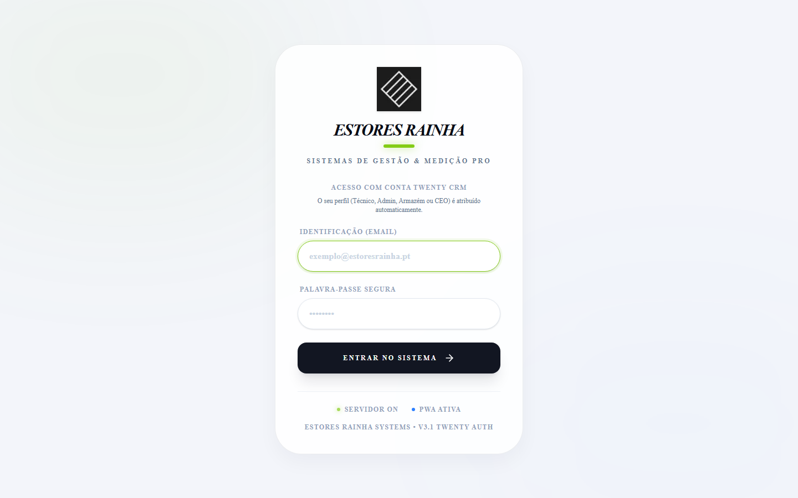
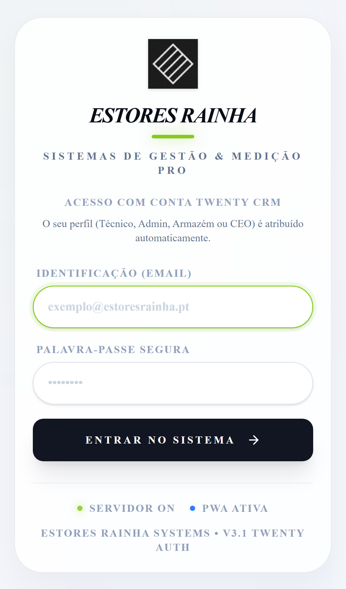
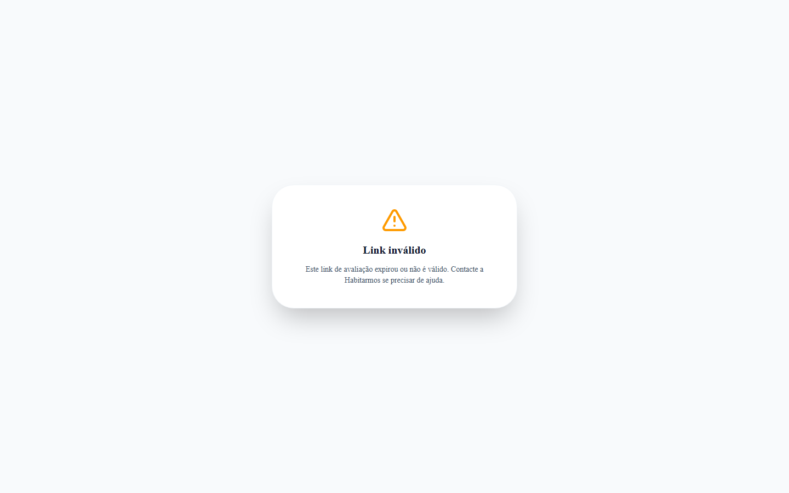
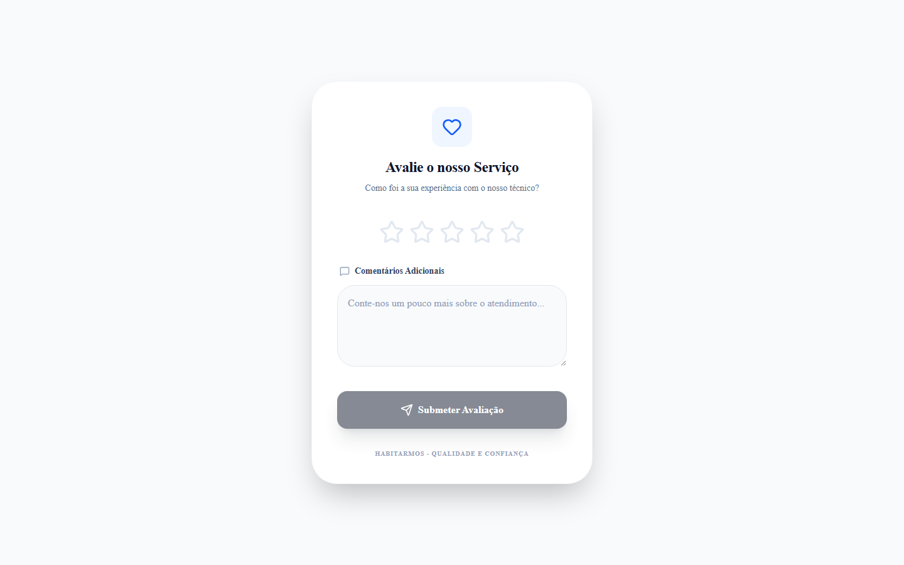
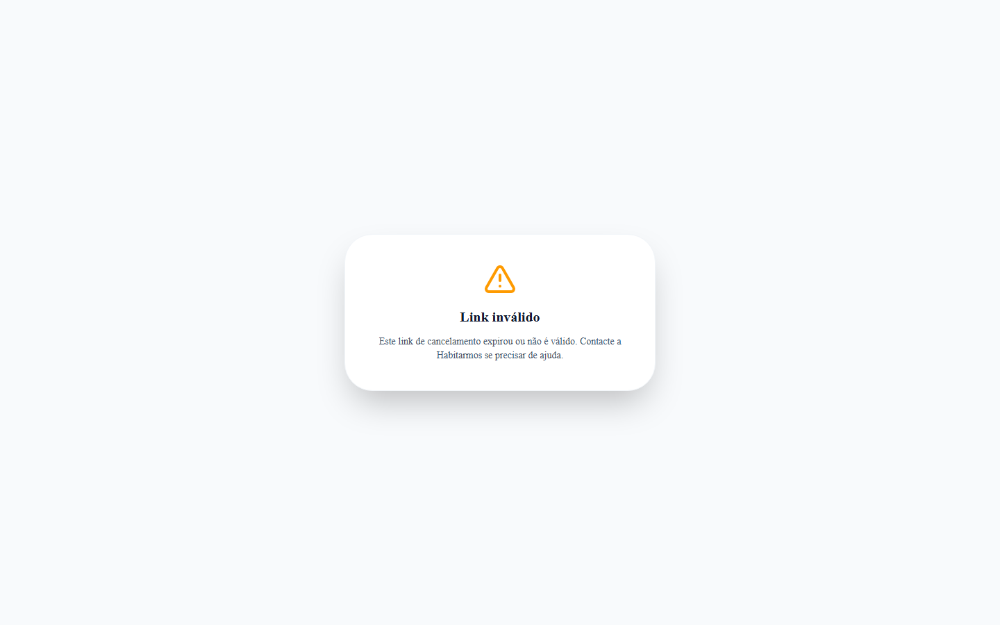
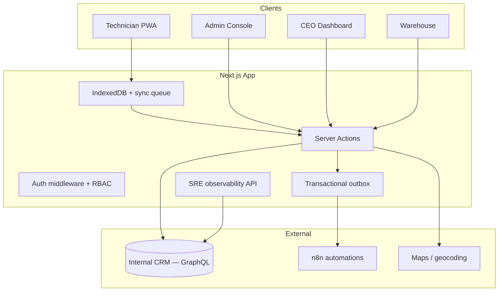
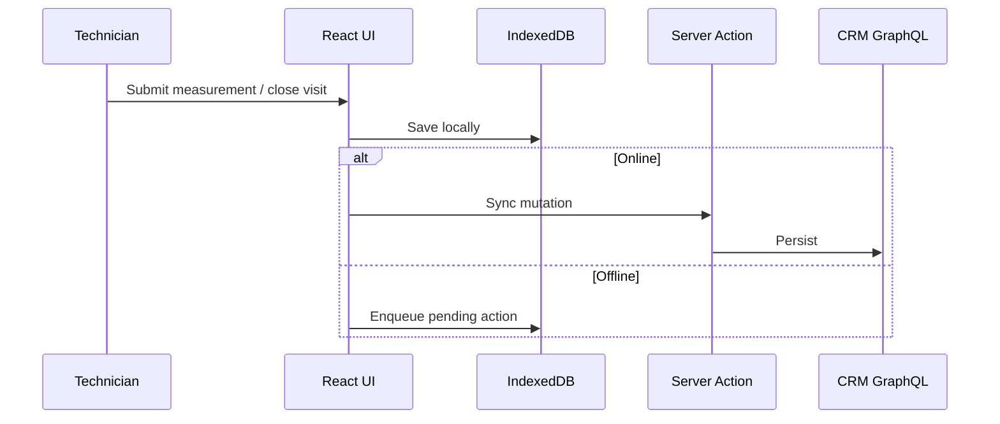

# Blinds Technical Services — Field Operations Platform

A production-grade **Progressive Web App** for blinds installation companies: scheduling, field work, warehouse prep, executive analytics, and customer self-service — synchronized with an internal CRM and built **offline-first** for technicians on the road.

<p align="center">
  
</p>

<p align="center">
  
  
</p>

**Live demo:** authentication required — clone the repo and point `TWENTY_*` env vars to your CRM instance.

---

## Table of contents

1. [Why we built this](#why-we-built-this)
2. [Features](#features)
3. [Screenshots](#screenshots)
4. [Architecture](#architecture)
5. [Tech stack](#tech-stack)
6. [Getting started](#getting-started)
7. [Project structure](#project-structure)
8. [Documentation](#documentation)

---

## Why we built this

### Problem

A blinds company serving **more than 15,000 customers** was stuck in organizational chaos.

- Customers called every day: *Where is my order? When will materials arrive? When can a technician visit?*
- **Hundreds of hours per month** were lost on phone calls, chats, and manual status checks.
- Route planning, travel spend, fuel, tolls, and stock were tracked in spreadsheets — or not at all.
- Departments worked on **paper and siloed tools**. When someone needed an answer, no one had the full picture.
- Data died between **sales, scheduling, warehouse, field teams, and leadership**.

### Solution

**Blinds Technical Services** connects the full lifecycle in one platform:

| Role | Capability |
|------|------------|
| **CEO** | Revenue, pipeline forecast, technician rankings, fleet km, NPS, follow-ups |
| **Admin / members** | Live map, calendar, AI route planning, bulk scheduling, paginated history |
| **Technicians (PWA)** | Day agenda, GPS, millimetre measurements, visit closure — **offline-first** |
| **Warehouse** | Per-item preparation status before installation |
| **Customers** | HMAC-signed links to rate a service or cancel an appointment |

All roles sync with the **internal CRM** (Twenty). Offline mutations queue in IndexedDB and replay when connectivity returns.

### Impact

- Single source of truth from **lead → measurement → install → payment**
- Fewer inbound calls — status lives in CRM and surfaces on the right screen
- Measurable logistics: optimized routes, cost estimates, zone insights
- Field teams stop re-typing; warehouse prepares before vans leave
- Leadership sees live metrics instead of month-end guesses

---

## Features

### Technician mobile PWA

- Offline task list with IndexedDB sync queue and retry jitter
- On-site states: scheduled → in progress → complete / incomplete / cancelled
- Product-group measurement forms
- One-tap navigation (Google Maps / Waze)
- Sync telemetry for operations monitoring

### Admin control center

- Map: unscheduled vs scheduled visits, overdue indicators, live technician pins
- Calendar per technician
- AI route strategy with fuel/toll estimates
- Mass scheduling, opportunity drawer, automatic geocoding
- Service history API with **50 items per page**

### CEO executive dashboard

- Won revenue, pipeline, weighted forecast, win rate
- Monthly evolution & funnel by stage
- Technician success rate and estimated km
- Customer ratings and follow-up urgency
- **Year-filtered CRM queries** (server-side date filters)

### Warehouse

- Service items linked to opportunities
- Preparation workflow before installation

### SRE observability *(admin role only)*

- CRM latency & circuit breaker
- Transactional outbox (pending / failed / reprocess)
- Offline sync telemetry per technician
- QA 360 diagnostic runner

### Public customer portals

- Service rating — signed expiring token (`/avaliacao/{id}?t=…`)
- Appointment cancellation — token + state guard (`/cancelamento/{id}?t=…`)

### Engineering quality

- Zod schemas, clean architecture (UI → actions → CRM layer)
- Circuit breaker, transactional outbox, 76+ unit tests, Playwright e2e
- GitHub Actions CI: type-check, test, build, smoke e2e
- RBAC: admin, CEO, technician, warehouse

---

## Screenshots

### Sign-in (CRM-backed roles)

Desktop and mobile entry — profile is resolved from the CRM workspace role.

<p align="center">
  
</p>

<p align="center">
  
</p>

### Customer self-service portals

Token-gated public pages — invalid links are rejected before any CRM mutation.

| Invalid rating link | Rating form UI | Cancellation guard |
|:---:|:---:|:---:|
|  |  |  |

> **Tip:** Run `node scripts/capture-readme-screenshots.mjs` with `SCREENSHOT_ADMIN_EMAIL` / `SCREENSHOT_ADMIN_PASSWORD` in `.env.local` to refresh authenticated admin, CEO, and technician captures.

---

## Architecture



**Offline sync**



---

## Tech stack

| Layer | Technology |
|-------|------------|
| Framework | Next.js 16, React 19 |
| Language | TypeScript, Zod |
| Styling | Tailwind CSS v4 |
| Local data | Dexie.js (IndexedDB) |
| CRM | Twenty (GraphQL + contract layer) |
| Auth | NextAuth.js, JWT, RBAC |
| Automation | n8n webhooks |
| Tests | Vitest (76+), Playwright |
| Deploy | Docker Compose, Nginx |

---

## Getting started

### Prerequisites

- Node.js 20+
- Twenty CRM instance + API key

### Install

```bash
git clone https://github.com/alyekseyenko/services-blinds.git
cd services-blinds
npm install
```

### Environment

```bash
cp .env.example .env.local
```

Required variables:

```env
TWENTY_API_URL=http://your-crm-host:3000
TWENTY_API_KEY=your_api_key
NEXTAUTH_SECRET=at_least_32_random_characters
NEXTAUTH_URL=http://localhost:3000
NEXT_PUBLIC_APP_URL=http://localhost:3000
```

### Commands

```bash
npm run dev         # development server
npm run validate    # type-check + unit tests
npm run test:e2e:smoke
npm run build       # production build
```

### Refresh README screenshots

```bash
node scripts/capture-readme-screenshots.mjs
```

---

## Project structure

```
src/
├── actions/              # Server Actions (use cases)
├── app/
│   ├── admin/            # Map, calendar, history, observability
│   ├── ceo/              # Executive dashboard
│   ├── dashboard/        # Technician PWA
│   ├── armazem/          # Warehouse
│   ├── avaliacao/        # Public rating portal
│   └── cancelamento/     # Public cancellation portal
├── components/
├── hooks/                # useSync, useSyncQueue
└── lib/crm/              # GraphQL integration + contract layer
docs/
├── adrs/                 # Architecture decision records
└── screenshots/          # README captures
```

---

## Documentation

- [Architecture blueprint](ARCHITECTURE_MASTER_BLUEPRINT.md)
- [Design system](DESIGN_SYSTEM.md)
- [Deployment guide](DEPLOY_HETZNER.md)
- [ADRs](docs/adrs/)

---

## License

Private — all rights reserved.
