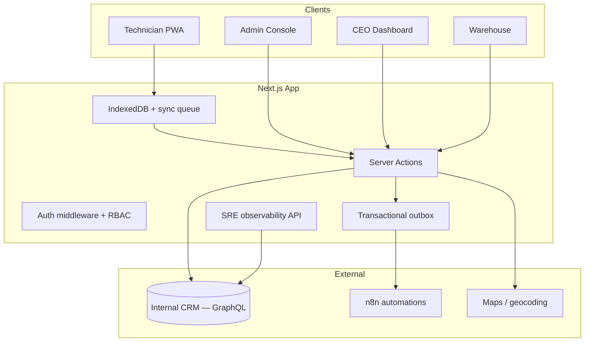
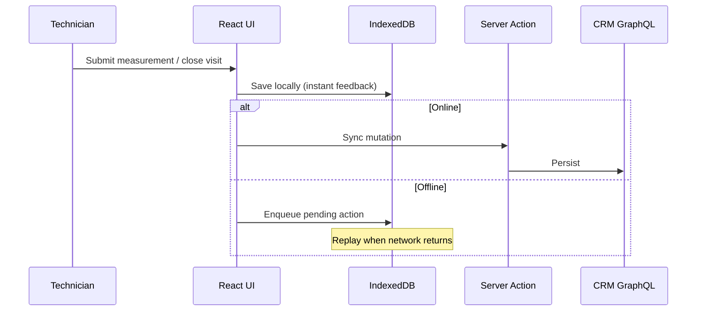

# Blinds Technical Services — Field Operations Platform

A production-grade **Progressive Web App** for blinds installation companies: scheduling, field work, warehouse prep, executive analytics, and customer self-service — all synchronized with an internal CRM and built **offline-first** for technicians on the road.

<p align="center">
  
  
  
</p>

---

## The story: problem → solution → impact

### The problem

A blinds company serving **more than 15,000 customers** was drowning in organizational chaos.

- Customers called constantly: *Where is my order? When will materials arrive? When can a technician visit?*
- **Hundreds of hours** were lost every month on phone calls, WhatsApp messages, and manual follow-ups.
- Route planning, travel costs, fuel, tolls, and stock levels were analyzed on spreadsheets — or not at all.
- Every department worked on **paper and disconnected tools**. When someone needed an answer, nobody had the full picture.
- Information died between **sales, scheduling, warehouse, field teams, and leadership**.

### The solution

**Blinds Technical Services** unifies the entire operation in one system:

| Role | What they get |
|------|----------------|
| **CEO** | Revenue, pipeline, technician performance, fleet km, customer satisfaction, follow-ups |
| **Admin / Members** | Live map, calendar, route optimization, bulk scheduling, pipeline management |
| **Technicians (PWA)** | Day agenda, GPS navigation, on-site measurements, visit closure — **works offline** |
| **Warehouse** | Preparation status per service item, handoff to installation teams |
| **Customers (public links)** | Signed URLs to rate a completed service or cancel an appointment |

Everything syncs with the **internal CRM** (Twenty). Changes made offline are queued locally and replayed when connectivity returns.

### The impact

- One source of truth from **first contact to completed installation**
- Fewer inbound calls — status lives in the CRM and flows to the right screen
- Measurable logistics: optimized routes, cost estimates, zone insights
- Field teams stop re-typing measurements; warehouse sees what to prepare before vans leave
- Leadership gets live metrics instead of end-of-month guesses

---

## Feature overview

### Field technician (mobile PWA)

- Offline-first task list with IndexedDB sync queue
- “Arrived on site” / in-progress visit states
- Millimetre-precision measurement forms per product group
- One-tap navigation (Google Maps / Waze)
- Visit completion with structured reasons (complete / incomplete / cancelled)
- Background sync telemetry for operations monitoring

### Admin control center

- Interactive map with unscheduled vs scheduled visits and overdue indicators
- Calendar view per technician
- AI-assisted route strategy and fuel/toll cost estimates
- Mass scheduling and opportunity drawer (notes, stage changes, geocoding)
- Paginated service history (completed / cancelled / incomplete)

### CEO executive dashboard

- Financial metrics: won revenue, pipeline forecast, weighted forecast, win rate
- Monthly evolution and pipeline funnel by stage
- Technician rankings, km estimates, first-time success rate
- Customer ratings, follow-up urgency list, warehouse preparation rate
- Year-filtered GraphQL queries (no more loading 1,000 records into the browser)

### Warehouse

- Service items linked to opportunities
- Preparation state tracking before installation visits

### SRE observability (admin-only)

- CRM health & latency, circuit breaker state
- Transactional outbox queue (pending / failed / reprocess)
- Live technician GPS summary (GDPR-aware windows)
- Offline sync telemetry per technician
- QA 360 diagnostic runner

### Public customer portals

- **Service rating** — HMAC-signed, expiring links (`/avaliacao/{id}?t=…`)
- **Appointment cancellation** — token-gated, only for schedulable task states

### Platform & reliability

- Zod schemas as single source of truth for domain types
- Clean architecture: UI → Server Actions → CRM infrastructure layer
- Circuit breaker on CRM GraphQL client
- Transactional outbox for n8n / notifications (at-least-once delivery)
- CI: type-check, 76+ unit tests, Playwright smoke e2e
- Role-based access: admin, CEO, technician, warehouse

---

## Architecture at a glance



**Offline sync flow**



---

## Tech stack

| Layer | Technology |
|-------|------------|
| Framework | Next.js 16 (App Router), React 19 |
| Language | TypeScript, Zod validation |
| Styling | Tailwind CSS v4 |
| Local data | Dexie.js (IndexedDB) |
| CRM | Twenty (GraphQL + contract layer) |
| Auth | NextAuth.js, JWT, RBAC |
| Automation | n8n webhooks |
| Tests | Vitest, Playwright |
| Deploy | Docker Compose, Nginx, VPS |

---

## Screenshots & assets

| Asset | Path |
|-------|------|
| App icon (512) | `public/icon-512.png` |
| PWA manifest icons | `public/icon-192.png`, `public/apple-touch-icon.png` |
| Brand marks | `logo/` |
| Favicon | `public/favicon.png` |

> Add production screenshots under `docs/screenshots/` when available (admin map, technician dashboard, CEO panel).

---

## Getting started

### Prerequisites

- Node.js 20+
- A running Twenty CRM instance with an API key

### Install

```bash
git clone https://github.com/alyekseyenko/services-blinds.git
cd services-blinds
npm install
```

### Environment

Copy `.env.example` to `.env.local` and fill in:

```env
TWENTY_API_URL=http://your-crm-host:3000
TWENTY_API_KEY=your_api_key
NEXTAUTH_SECRET=at_least_32_random_characters
NEXTAUTH_URL=http://localhost:3000
NEXT_PUBLIC_APP_URL=http://localhost:3000
```

### Run

```bash
npm run dev        # development
npm run validate   # type-check + unit tests
npm run build      # production build
```

---

## Project structure

```
src/
├── actions/           # Server Actions (use cases)
├── app/
│   ├── admin/         # Map, calendar, history, observability
│   ├── ceo/           # Executive dashboard
│   ├── dashboard/     # Technician PWA
│   ├── armazem/       # Warehouse
│   ├── avaliacao/     # Public rating portal
│   └── cancelamento/  # Public cancellation portal
├── components/        # UI by domain
├── hooks/             # useSync, useSyncQueue
└── lib/
    ├── crm/           # CRM integration (only place that talks to GraphQL)
    ├── schemas/       # Zod models
    └── publicTokens.ts# Signed customer links
docs/adrs/             # Architecture decision records
```

---

## Documentation

- [Architecture blueprint](ARCHITECTURE_MASTER_BLUEPRINT.md)
- [Design system](DESIGN_SYSTEM.md)
- [Deployment guide](DEPLOY_HETZNER.md)
- [ADRs](docs/adrs/)

---

## License

Private — all rights reserved.
