# End-to-End Business Flow — Blinds Technical Services

Complete reference from **client intake** through **pipeline completion or cancellation**, including commercial follow-ups, notifications, intelligence layers, and CEO analytics.

> **Audience:** CEO, operations, and technical leadership.  
> **Source of truth in code:** `src/lib/crm/contract.ts`, `src/lib/crm/opportunities.ts`, `src/lib/crm/tasks.ts`, `src/lib/crm/ceoMetrics.ts`

---

## Table of contents

1. [Executive summary](#1-executive-summary)
2. [Actors and systems](#2-actors-and-systems)
3. [Master end-to-end diagram](#3-master-end-to-end-diagram)
4. [Opportunity pipeline — all stages](#4-opportunity-pipeline--all-stages)
5. [Three main service paths](#5-three-main-service-paths)
6. [Task lifecycle (field visits)](#6-task-lifecycle-field-visits)
7. [Commercial layer — proposal and follow-up](#7-commercial-layer--proposal-and-follow-up)
8. [Warehouse layer](#8-warehouse-layer)
9. [Notifications and automations](#9-notifications-and-automations)
10. [Public client portals](#10-public-client-portals)
11. [Intelligence and AI layers](#11-intelligence-and-ai-layers)
12. [CEO analytics layer](#12-ceo-analytics-layer)
13. [Data model reference](#13-data-model-reference)
14. [Automation matrix — who does what](#14-automation-matrix--who-does-what)

---

## 1. Executive summary

A customer request becomes an **Opportunity** in Twenty CRM and moves through a **15-stage commercial/operational pipeline** until it reaches **`CONCLUIDO`** (won) or **`CANCELADO`** (lost).

The **Blinds Technical Services PWA** orchestrates field operations:

| Layer | Role |
|-------|------|
| **Twenty CRM** | Single source of truth — opportunities, contacts, tasks, service items, amounts, follow-up dates |
| **PWA (this app)** | Technician PWA, admin map/calendar, warehouse, CEO dashboard |
| **n8n** | Email, WhatsApp, PDF reports, Google Drive, push campaigns |
| **Google Maps** | Routing, geocoding, live technician GPS |

**Key principle:** Commercial stages (`PROPOSTA`, `PAGAMENTO_30`, `ENCOMENDA`, follow-ups) are primarily managed in **Twenty CRM + n8n**. The app automates **scheduling, field execution, warehouse prep, and analytics**.

---

## 2. Actors and systems

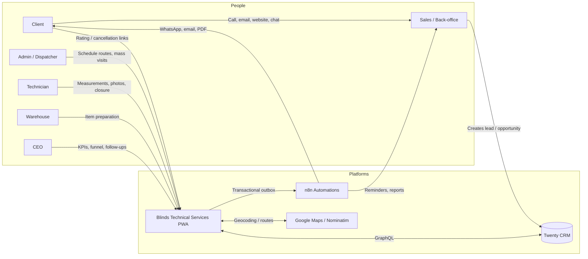

### User roles in the app

| App role | Route | Access |
|----------|-------|--------|
| `technician` | `/dashboard` | Day agenda, measurements, visit closure, offline sync |
| `warehouse` | `/armazem` | Preparation list at stage `PREPARACAO` |
| `member` | `/admin` | Map, calendar, history (no CEO/SRE) |
| `admin` | `/admin` + `/ceo` + SRE | Full operational + executive + observability |
| `ceo` | `/ceo` + `/admin` | Executive metrics + operations |

---

## 3. Master end-to-end diagram

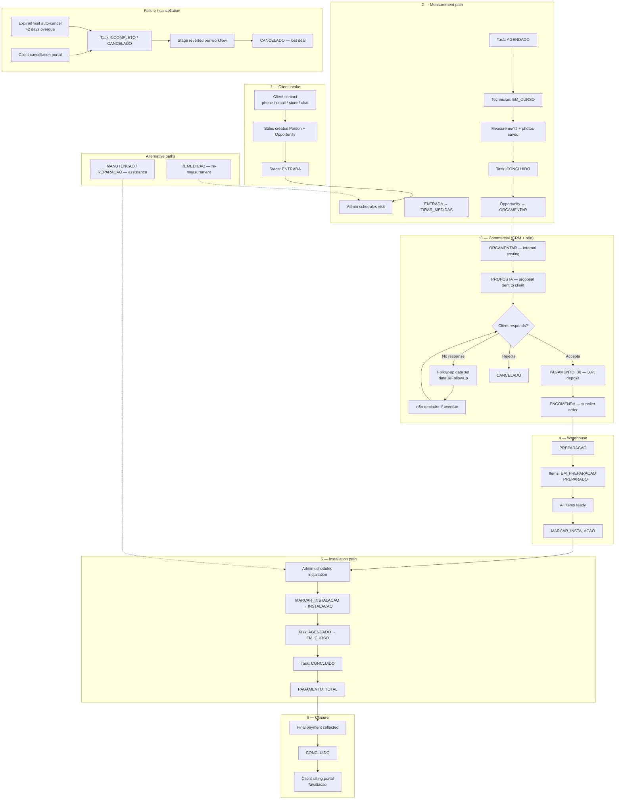

---

## 4. Opportunity pipeline — all stages

### Full stage map

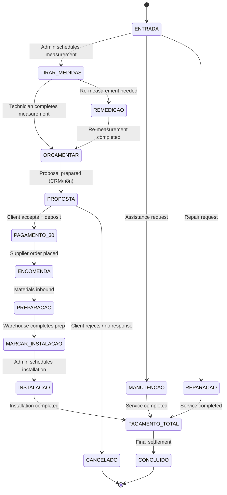

### Stage reference table

| Stage code | Business label | Close probability (CEO forecast) | Automated by app? |
|------------|----------------|----------------------------------|---------------------|
| `ENTRADA` | New request / lead | 15% | Shown on admin map; advances on schedule |
| `TIRAR_MEDIDAS` | Measurement visit | 25% | ✅ Schedule + complete |
| `REMEDICAO` | Re-measurement | 30% | ✅ Schedule + complete |
| `ORCAMENTAR` | Internal costing | 40% | ⬜ CRM / back-office |
| `PROPOSTA` | Proposal sent | 50% | ⬜ CRM + n8n delivery |
| `PAGAMENTO_30` | 30% deposit received | 85% | ⬜ CRM / finance |
| `ENCOMENDA` | Supplier order | 90% | ⬜ CRM / procurement |
| `PREPARACAO` | Warehouse preparation | 95% | ✅ Warehouse app |
| `MARCAR_INSTALACAO` | Awaiting installation slot | 98% | ✅ Shown on admin map |
| `AGENDAR_INSTALACAO` | Schedule installation *(legacy alias)* | 98% | ⬜ Not in live CRM enum |
| `INSTALACAO` | Installation in progress | 98% | ✅ Schedule + complete |
| `PAGAMENTO_TOTAL` | Final billing | 100% | ⬜ CRM / finance |
| `CONCLUIDO` | Job completed | 100% | History + CEO metrics |
| `CANCELADO` | Lost / cancelled | 0% | History + CEO metrics |
| `MANUTENCAO` | Maintenance | 75% | ✅ Field service flow |
| `REPARACAO` | Repair | 75% | ✅ Field service flow |

---

## 5. Three main service paths

### A. Measurement → installation (standard blinds job)

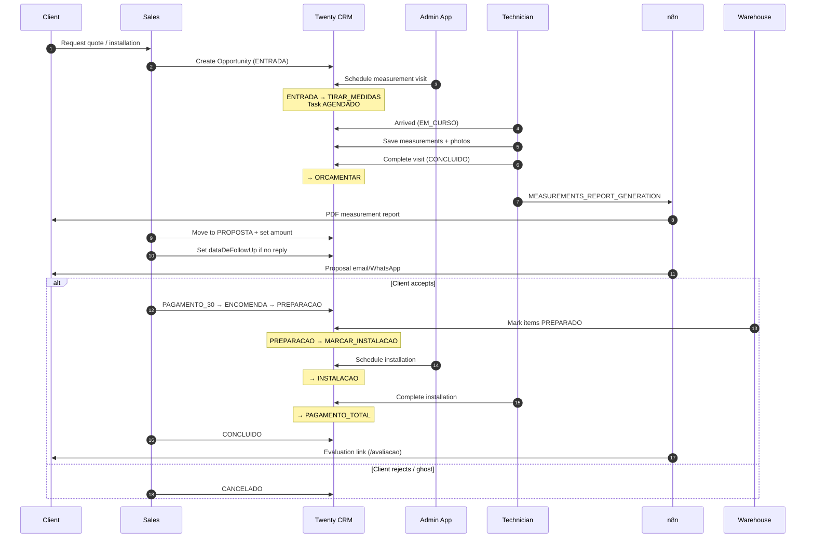

### B. Assistance (maintenance / repair)

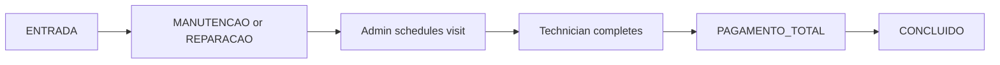

On incomplete/cancel, stage reverts to `MANUTENCAO` or `REPARACAO` (not `ENTRADA`).

### C. Re-measurement (remediation)

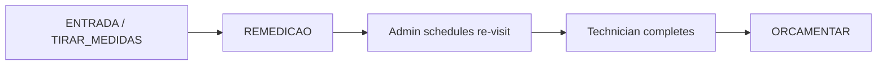

Scheduling from `REMEDICAO` keeps the same stage (does not auto-advance).

---

## 6. Task lifecycle (field visits)

Each scheduled visit creates a **Task** linked to the Opportunity via `taskTargets`.

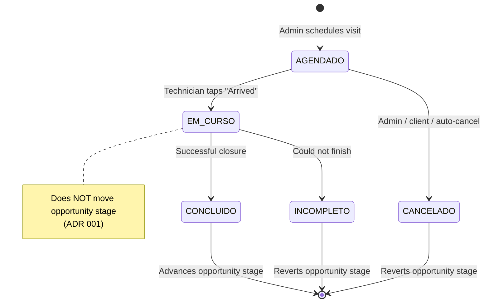

### Task status reference

| Status | Meaning | Opportunity impact |
|--------|---------|-------------------|
| `AGENDADO` | Scheduled, not started | None |
| `EM_CURSO` | Technician on site | None (stage unchanged) |
| `CONCLUIDO` | Visit successful | Advances per workflow (see below) |
| `INCOMPLETO` | Visit failed | Reverts to fallback stage |
| `CANCELADO` | Visit cancelled | Reverts to fallback stage |

### Opportunity advance on task completion

| Workflow | On `CONCLUIDO` → stage becomes |
|----------|-------------------------------|
| `measurement` | `ORCAMENTAR` |
| `installation` | `PAGAMENTO_TOTAL` |
| `maintenance` | `PAGAMENTO_TOTAL` |
| `repair` | `PAGAMENTO_TOTAL` |
| `other` | No auto-advance |

### Opportunity revert on incomplete/cancel

| Workflow | Reverts to |
|----------|------------|
| `measurement` | `ENTRADA` |
| `installation` | `MARCAR_INSTALACAO` |
| `maintenance` | `MANUTENCAO` |
| `repair` | `REPARACAO` |

### Incomplete reasons (technician UI)

`cliente_ausente`, `sem_acesso`, `falta_material`, `reagendar`, `outro` — stored in task body.

### Auto-maintenance (>2 days overdue)

Scheduled task still `AGENDADO` and **>2 days past `dueAt`** → automatic cancellation via `opportunityMaintenance.ts` (skips `EM_CURSO`, `CONCLUIDO`, `CANCELADO`).

---

## 7. Commercial layer — proposal and follow-up

This layer lives primarily in **Twenty CRM** and is surfaced in the **CEO dashboard**. The app reads but does not write follow-up dates.

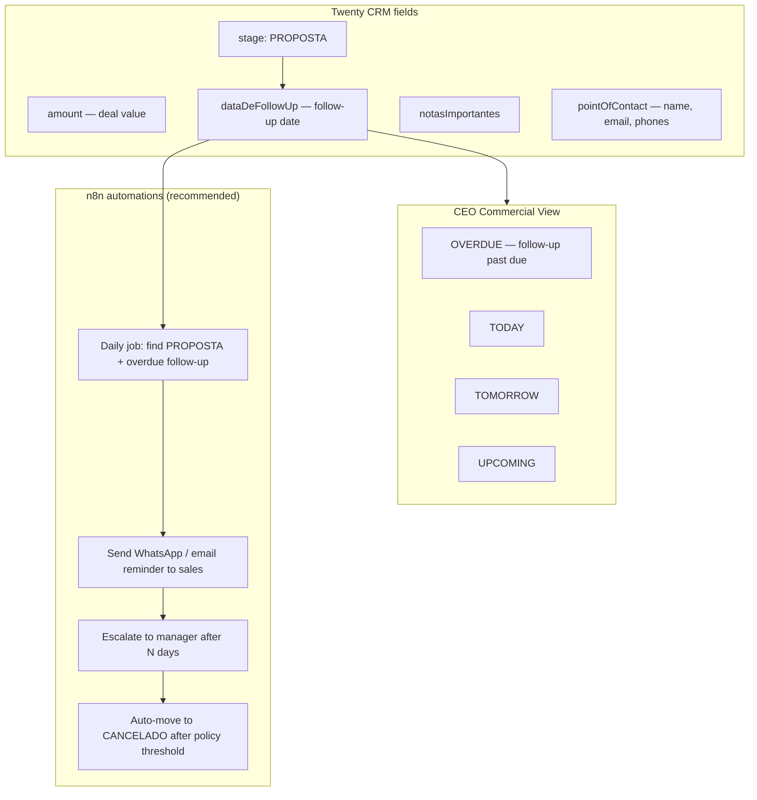

### Proposal flow detail

| Step | Who | System | Data written |
|------|-----|--------|--------------|
| 1. Costing complete | Back-office | Twenty CRM | `stage → ORCAMENTAR` |
| 2. Proposal generated | n8n | PDF from measurement data | Google Drive link |
| 3. Proposal sent | n8n | Email / WhatsApp | Delivery log |
| 4. Stage updated | Sales | Twenty CRM | `stage → PROPOSTA`, `amount` set |
| 5. No response | Sales | Twenty CRM | `dataDeFollowUp` set (e.g. +3 days) |
| 6. Follow-up reminder | n8n | Reads CRM or webhook | Notification to sales |
| 7. Client accepts | Sales | Twenty CRM | `stage → PAGAMENTO_30` |
| 8. Client rejects | Sales | Twenty CRM | `stage → CANCELADO` |

### CEO follow-up urgency logic

Read from `dataDeFollowUp` in `ceoMetrics.ts`:

| Urgency | Condition |
|---------|-----------|
| `OVERDUE` | Follow-up date < today |
| `TODAY` | Follow-up date = today |
| `TOMORROW` | Follow-up date = tomorrow |
| `UPCOMING` | Follow-up date > tomorrow |

Displayed in `CeoCommercialView.tsx` with client name, phone, deal amount, and stage.

---

## 8. Warehouse layer

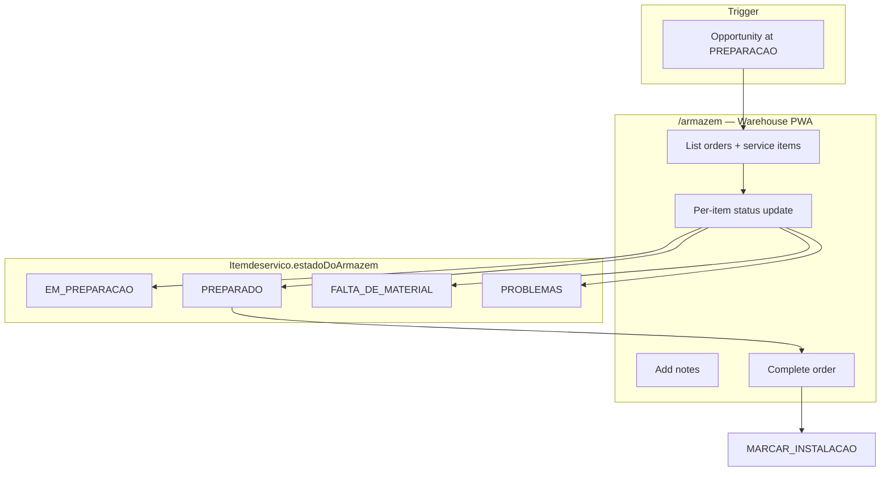

| Rule | Detail |
|------|--------|
| Access | Role `warehouse` only |
| List filter | Opportunities at stage `PREPARACAO` with linked `servicoitem` records |
| Complete guard | All items must be `PREPARADO` before order completion |
| Stage advance | `PREPARACAO` → `MARCAR_INSTALACAO` |
| Measurement lock | Cannot re-save measurements if warehouse prep already started |

---

## 9. Notifications and automations

### Architecture

```mermaid
flowchart LR
    APP[App event] --> OB[Transactional Outbox<br/>outbox_events.json]
    OB -->|HTTP POST| N8N[n8n webhooks]
    N8N --> WA[WhatsApp]
    N8N --> EM[Email]
    N8N --> PDF[PDF / Excel reports]
    N8N --> GD[Google Drive]
    N8N --> PUSH[Push notifications]

    TECH[Technician browser] --> PS[Push subscription]
    PS --> API[/api/push/subscribe]
    API --> N8N
```

### Event catalog

| Event type | Trigger | Destination webhook | Payload highlights |
|------------|---------|---------------------|-------------------|
| `technician_login` | User signs in | `N8N_WEBHOOK_URL` | User id, name, role |
| `technician_report` | Task cancelled / incomplete | `N8N_WEBHOOK_URL` | Reason, task, opportunity |
| `service_completed` | Task completed | `N8N_WEBHOOK_URL` | Client, address, technician |
| `MEASUREMENTS_REPORT_GENERATION` | Measurements saved | `N8N_WEBHOOK_URL` | Room dimensions, opportunity id |
| `SERVICE_REPORT_SUBMITTED` | Visit closed with report | `N8N_WEBHOOK_URL_REPORTS` | Photos, Drive folder metadata |
| `PUSH_SUBSCRIPTION` | Browser push opt-in | `N8N_WEBHOOK_URL_PUSH` | VAPID subscription, user id |

### Links embedded in notifications

| Link | Purpose | Security |
|------|---------|----------|
| `evaluationUrl` | `/avaliacao/{opportunityId}?t=...` | HMAC token, 30-day TTL |
| `cancelUrl` | `/cancelamento/{taskId}?t=...` | HMAC token, 30-day TTL |

Built in `notificationAction.ts` via `publicTokens.ts`.

### Delivery guarantees

- **Outbox pattern:** `src/lib/outboxQueue.ts` — persist → attempt → retry with backoff → dead-letter
- **Reprocess:** `/admin/observabilidade` or `/api/observability` (`REPROCESS_OUTBOX`)
- **Offline technician sync:** separate IndexedDB queue (`useSyncQueue`) — not the n8n outbox

### Push notifications (visit alerts)

| Component | Behavior |
|-----------|----------|
| `PushOptInPrompt` | One-time browser permission; stored in `localStorage` |
| `public/sw.js` | Receives push; opens `/dashboard` on click |
| n8n | Sends route-change and visit reminders to subscribed technicians |

---

## 10. Public client portals

```mermaid
flowchart LR
    N8N[n8n sends link] --> C[Client phone]
    C --> E[/avaliacao/id?t=token]
    C --> X[/cancelamento/id?t=token]

    E --> R1[Rate 1-5 stars]
    E --> R2[Written feedback]
    R1 --> CRM1[avaliacaoDoCliente]
    R2 --> CRM2[feedbackDoCliente]

    X --> R3[Cancel with reason]
    R3 --> T1[Task → CANCELADO]
```

| Portal | Auth | Rules |
|--------|------|-------|
| `/avaliacao/[id]` | HMAC token | One rating per opportunity; rate-limited |
| `/cancelamento/[id]` | HMAC token | Task must be `AGENDADO` or `EM_CURSO` |

---

## 11. Intelligence and AI layers

### Current intelligence (live in app)

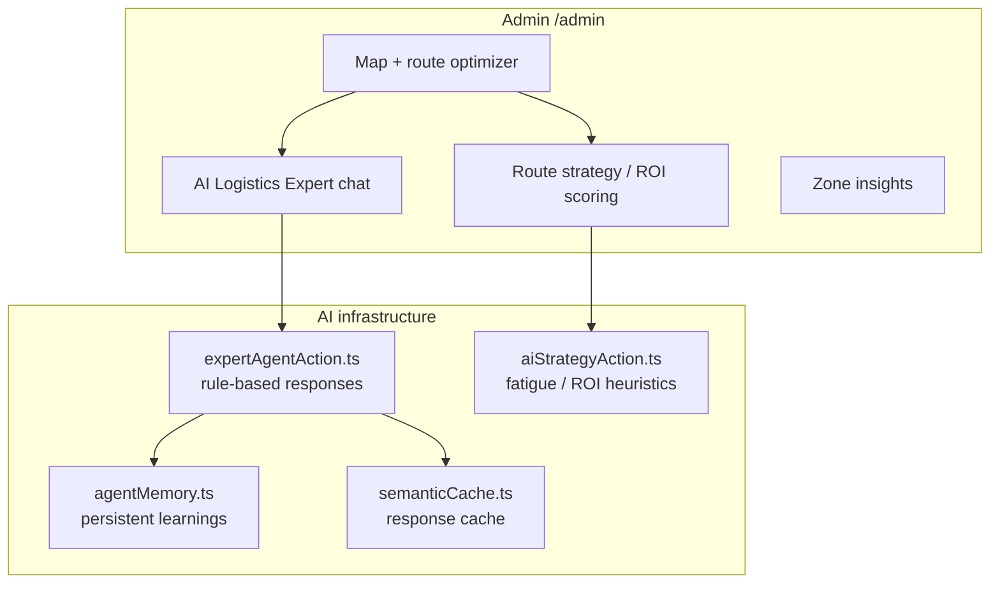

| Feature | What it does today | LLM? |
|---------|-------------------|------|
| **AI Logistics Expert** | Answers route questions, finds waiters, suggests waypoints, learns user preferences ("remember that…") | No — rule/template based |
| **Route strategy** | Scores routes by ROI, technician fatigue, distance | Heuristic |
| **Semantic cache** | Instant repeat answers for similar questions | No |
| **Agent memory** | Stores business learnings across sessions | No |
| **Route optimizer** | Google Directions + TSP heuristic | No |
| **Zone insights** | Clusters opportunities by geography | Algorithmic |

### Planned / external layer — AI CRM intake via chat

> **Not yet implemented in the app codebase.** Recommended architecture for WhatsApp / website chat → CRM lead creation:

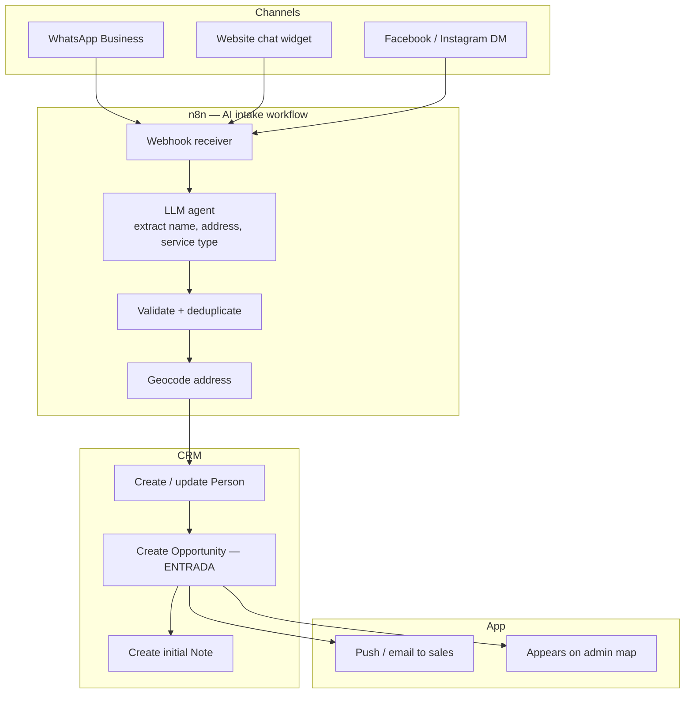

| Intake field | CRM target |
|--------------|------------|
| Client name | `Person.name` |
| Phone / email | `Person.phones`, `Person.emails` |
| Service address | `Opportunity.moradaDeServico` |
| Service type | `Opportunity` stage / title / notes |
| Urgency | `notasImportantes` |
| Source channel | Note or custom field |

---

## 12. CEO analytics layer

**Route:** `/ceo` — roles `admin`, `ceo` only.

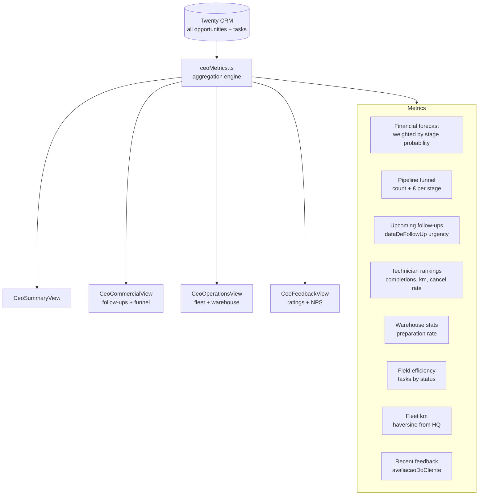

### CEO dashboard tabs

| Tab | Key metrics |
|-----|-------------|
| **Summary** | Revenue won, weighted pipeline forecast, conversion rate, avg rating, monthly evolution chart |
| **Commercial** | Full funnel by stage, upcoming follow-ups (`OVERDUE` / `TODAY` / `TOMORROW`), deal amounts |
| **Operations** | Technician km, warehouse prep rate, field task distribution, service list with filters |
| **Feedback** | Client ratings, written feedback, NPS-style overview |

### Stage weights for revenue forecast

Used in `ceoMetrics.ts` — example: `ENTRADA` 15% → `PROPOSTA` 50% → `PREPARACAO` 95% → `CONCLUIDO` 100%.

---

## 13. Data model reference

### Opportunity (deal)

| Field (CRM) | App usage |
|-------------|-----------|
| `id` | Primary key |
| `name` / `nsi` | Display, search |
| `stage` | Pipeline position |
| `amount` | CEO financial metrics |
| `dataDeFollowUp` | CEO commercial follow-ups |
| `moradaDeServico` | Map coordinates, routing |
| `pointOfContact` | Client name, email, phones |
| `avaliacaoDoCliente` | Post-service rating (1–5) |
| `feedbackDoCliente` | Written client feedback |
| `notasImportantes` | Internal notes |
| `servicoitem` | Warehouse items, measurements |

### Task (field visit)

| Field (CRM) | App usage |
|-------------|-----------|
| `status` | AGENDADO → EM_CURSO → CONCLUIDO |
| `dueAt` | Calendar, overdue maintenance |
| `technicianName` | Assignment display |
| `assigneeId` | CRM user link |
| `moradaDaReparacao` | Visit address |
| `bodyV2.markdown` | Observations, cancel reasons |

### Service item (warehouse)

| Field (CRM) | App usage |
|-------------|-----------|
| `produto`, `largura`, `altura`, `quantidade` | Product spec |
| `localizacao`, `cor` | Room / color |
| `preparado`, `estadoDoArmazem` | Warehouse workflow |

---

## 14. Automation matrix — who does what

| Action | App | Twenty CRM manual | n8n |
|--------|-----|-------------------|-----|
| Create lead / opportunity | — | ✅ | 🔮 AI chat intake (planned) |
| Schedule field visit | ✅ | — | Optional reminder |
| Technician arrived (`EM_CURSO`) | ✅ | — | — |
| Save measurements | ✅ | — | ✅ PDF report |
| Complete measurement visit | ✅ | — | ✅ Notification |
| Send proposal | — | ✅ stage change | ✅ delivery |
| Set follow-up date | — | ✅ `dataDeFollowUp` | ✅ reminders |
| Record deposit / payment | — | ✅ | Optional receipt |
| Warehouse preparation | ✅ | — | Optional alert |
| Schedule installation | ✅ | — | ✅ client confirmation |
| Complete installation | ✅ | — | ✅ service report + photos |
| Final payment / close | — | ✅ | — |
| Client rating | ✅ portal | ✅ fields written | — |
| Client cancel visit | ✅ portal | via task cancel | — |
| CEO dashboard | ✅ read-only | — | — |
| Push notifications | ✅ subscribe | — | ✅ send |
| GPS technician tracking | ✅ with consent | — | — |
| Auto-cancel expired visits | ✅ maintenance job | — | Optional notify |

**Legend:** ✅ implemented · — not applicable · 🔮 planned/recommended

---

## Related documentation

| Document | Topic |
|----------|-------|
| [ARCHITECTURE_MASTER_BLUEPRINT.md](../ARCHITECTURE_MASTER_BLUEPRINT.md) | Full system architecture, outbox, offline sync |
| [ESTUDO_ARQUITETURA.md](../ESTUDO_ARQUITETURA.md) | Architecture study (PT) |
| [N8N_SETUP.md](../N8N_SETUP.md) | Webhook configuration |
| [docs/adrs/001-em-curso-pipeline.md](./adrs/001-em-curso-pipeline.md) | `EM_CURSO` does not move pipeline |
| [docs/adrs/002-offline-queue.md](./adrs/002-offline-queue.md) | IndexedDB sync queue |
| [docs/adrs/003-public-portal-tokens.md](./adrs/003-public-portal-tokens.md) | HMAC public links |

---

*Last updated: September 2026 — reflects production CRM enum and current app codebase.*
